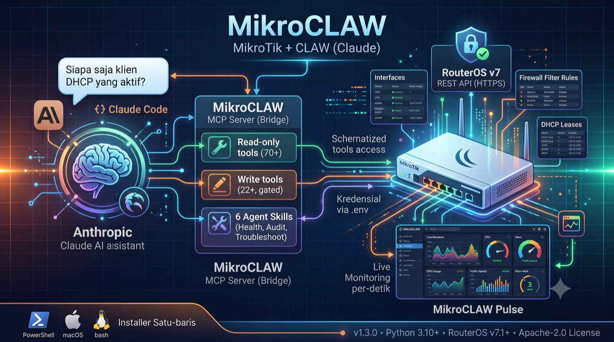
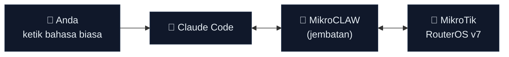
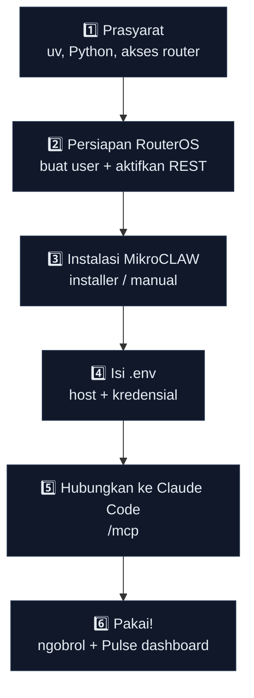
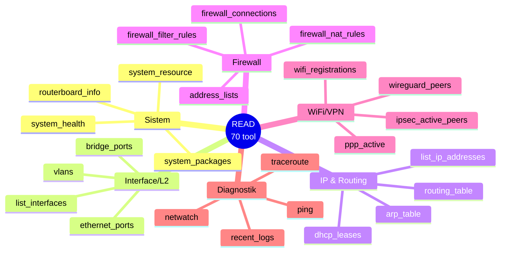
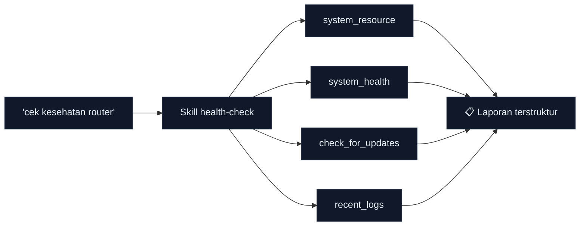
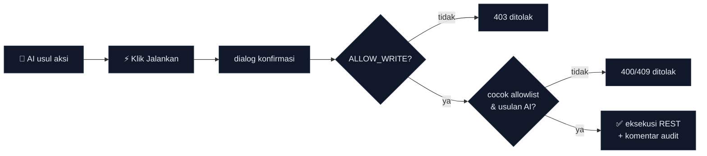
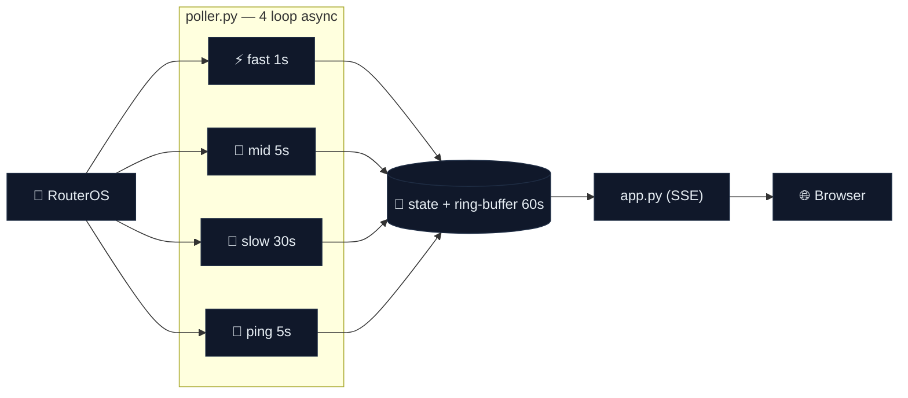
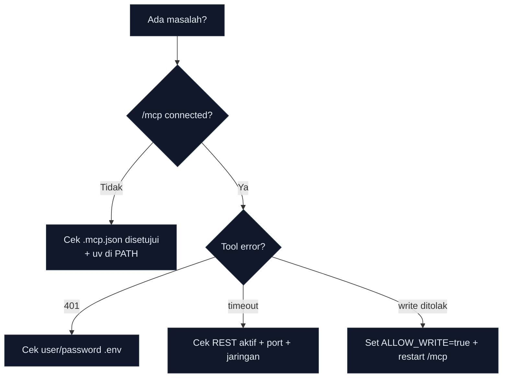
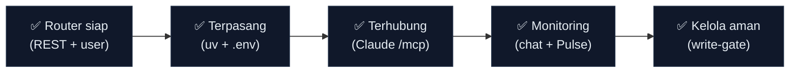

<div align="center">



# 📘 MANUAL BOOK — MikroCLAW

### Panduan Pengguna Lengkap, Langkah demi Langkah

**Dari instalasi hingga monitoring live — untuk pemula maupun admin jaringan.**

`v1.5.0` · RouterOS v7.1+ · Python 3.10+ · Apache-2.0

</div>

---

## 🧭 Daftar Isi

| Bab | Judul | Untuk apa |
|---|---|---|
| — | [Sekilas MikroCLAW](#-sekilas-mikroclaw) | Memahami konsep dalam 2 menit |
| **0** | [Peta Perjalanan](#-bab-0--peta-perjalanan) | Gambaran semua langkah |
| **1** | [Prasyarat](#-bab-1--prasyarat) | Yang harus disiapkan dulu |
| **2** | [Persiapan RouterOS](#-bab-2--persiapan-routeros) | Setting di router |
| **3** | [Instalasi MikroCLAW](#-bab-3--instalasi-mikroclaw) | Pasang di komputer |
| **4** | [Konfigurasi `.env`](#-bab-4--konfigurasi-env) | Isi kredensial |
| **5** | [Menghubungkan ke Claude Code](#-bab-5--menghubungkan-ke-claude-code) | Aktifkan di Claude |
| **6** | [Penggunaan Dasar](#-bab-6--penggunaan-dasar-percakapan-pertama) | Percakapan pertama |
| **7** | [Menjelajah Tool READ](#-bab-7--menjelajah-tool-read) | Monitoring & inspeksi |
| **8** | [Operasi WRITE (mengubah config)](#-bab-8--operasi-write-mengubah-konfigurasi) | Mengubah router dengan aman |
| **9** | [Agent Skills](#-bab-9--agent-skills-playbook-otomatis) | Playbook otomatis |
| **10** | [MikroCLAW Pulse](#-bab-10--mikroclaw-pulse-dashboard-live) | Dashboard live |
| **11** | [Keamanan & Praktik Terbaik](#-bab-11--keamanan--praktik-terbaik) | Jaga keamanan |
| **12** | [Troubleshooting](#-bab-12--troubleshooting) | Saat ada masalah |
| **13** | [Uninstall](#-bab-13--uninstall) | Mencopot |
| **14** | [FAQ](#-bab-14--faq) | Pertanyaan umum |
| — | [Kesimpulan](#-kesimpulan) | Penutup |

---

## 🎯 Sekilas MikroCLAW

**MikroCLAW** membuat **Claude Code** (asisten AI dari Anthropic) bisa **membaca dan mengelola router MikroTik** Anda — cukup dengan mengetik dalam bahasa biasa.

> Anda: *"Siapa saja klien DHCP yang aktif?"*
> Claude: *(otomatis memanggil tool `dhcp_leases`)* → menampilkan daftar klien.

Tanpa MikroCLAW, Claude tidak tahu cara bicara dengan MikroTik. MikroCLAW adalah **jembatan (MCP server)** yang menerjemahkan permintaan Claude menjadi panggilan **REST API RouterOS v7**.



**Tiga kemampuan utama:**

| | Kemampuan | Penjelasan |
|---|---|---|
| 🧩 | **92 Tool** | 70 baca (read) + 22 ubah (write) — dari `system_resource` sampai `add_firewall_drop`. |
| 🧠 | **6 Agent Skills** | Playbook siap pakai: health-check, audit firewall, audit keamanan, overview, troubleshoot, backup. |
| 📟 | **Pulse** | Dashboard web monitoring **live per-detik** di browser. |

> 🔒 **Aman secara default:** MikroCLAW **read-only** sampai Anda sengaja membuka gerbang write (`MIKROCLAW_ALLOW_WRITE=true`). Kredensial hanya disimpan di file `.env`, tidak pernah muncul di chat.

---

## 🗺️ Bab 0 — Peta Perjalanan

Inilah seluruh langkah yang akan Anda lalui. Setiap kotak adalah satu bab.



**Estimasi waktu:** ±15–20 menit untuk pertama kali (mayoritas otomatis lewat installer).

> 💡 **Buru-buru?** Lompat ke [Bab 3 — Instalasi otomatis (bootstrap 1-baris)](#31-jalur-cepat--bootstrap-satu-baris-direkomendasikan). Installer mengurus hampir semuanya. Tapi Anda tetap perlu menyiapkan **user di router** dulu (Bab 2).

---

## ✅ Bab 1 — Prasyarat

Centang daftar ini sebelum mulai:

```
☐ Router MikroTik dengan RouterOS v7.1 atau lebih baru
☐ Komputer (Windows / macOS / Linux) yang bisa menjangkau router
☐ Akses admin ke router (Winbox / WebFig / SSH)
☐ Claude Code sudah terpasang  (https://claude.ai/code)
☐ Koneksi internet (untuk mengunduh uv + dependency saat instalasi)
```

### Tabel prasyarat detail

| Komponen | Versi | Cara cek | Catatan |
|---|---|---|---|
| **RouterOS** | v7.1+ | Winbox → *System → Resources*, lihat `version` | REST API **hanya** ada di v7. Router v6? Lihat [Bab 14 FAQ](#-bab-14--faq). |
| **Python** | 3.10+ | `python3 --version` | `uv` bisa mengunduh Python otomatis bila belum ada. |
| **uv** | terbaru | `uv --version` | Pengelola environment. Installer memasang otomatis bila belum ada. |
| **Claude Code** | terbaru | `claude --version` | Tempat Anda mengetik perintah. |
| **Jaringan** | — | `ping 192.168.88.1` | Komputer harus bisa menjangkau port **443** (HTTPS) atau **80** (HTTP) router. |

> ⚠️ **Belum punya `uv`?** Tidak masalah — installer otomatis (Bab 3) akan memasangnya. Kalau ingin manual: <https://docs.astral.sh/uv/>

---

## 📡 Bab 2 — Persiapan RouterOS

Tujuan bab ini: **mengaktifkan REST API** di router dan **membuat user khusus** untuk MikroCLAW. Cukup dilakukan **sekali**.

> 🔐 **Prinsip emas:** JANGAN gunakan user `admin` penuh. Buat user khusus dengan hak minimal (least-privilege).

### Langkah 2.1 — Buka terminal router

Pilih salah satu:
- **Winbox** → tombol **New Terminal**, atau
- **WebFig** (browser ke IP router) → menu **Terminal**, atau
- **SSH**: `ssh admin@192.168.88.1`

### Langkah 2.2 — Buat user khusus MikroCLAW

Untuk **monitoring read-only** (paling aman, disarankan untuk awal):

```routeros
/user/add name=mikroclaw password=PasswordKuat123! group=read
```

Bila nanti Anda butuh **mengubah konfigurasi** lewat MikroCLAW, gunakan group `write`:

```routeros
/user/add name=mikroclaw password=PasswordKuat123! group=write
```

**Contoh output sukses** (tidak ada pesan = berhasil). Verifikasi:

```routeros
/user/print
```
```
 # NAME       GROUP   ADDRESS         LAST-LOGGED-IN
 0 admin      full                    jun/27/2026 08:01:12
 1 mikroclaw  read                    never
```

### Langkah 2.3 — Aktifkan service REST (www-ssl untuk HTTPS)

**Opsi A — HTTPS (disarankan, aman):** butuh sertifikat. Jika sudah punya:

```routeros
/ip/service/set www-ssl certificate=nama-sertifikat-anda disabled=no
```

Belum punya sertifikat? Buat self-signed sekali:

```routeros
/certificate/add name=mikroclaw-ca common-name=mikroclaw-ca key-usage=key-cert-sign,crl-sign
/certificate/sign mikroclaw-ca
/certificate/add name=mikroclaw-https common-name=192.168.88.1
/certificate/sign mikroclaw-https ca=mikroclaw-ca
/ip/service/set www-ssl certificate=mikroclaw-https disabled=no
```

> ⏳ Proses `sign` bisa makan beberapa detik. Tunggu sampai selesai (`progress: done`).

**Opsi B — HTTP biasa (cepat, kurang aman, hanya untuk LAN tepercaya / uji coba):**

```routeros
/ip/service/set www disabled=no
```

### Langkah 2.4 — Batasi siapa yang boleh akses (hardening)

Izinkan hanya subnet/host admin Anda:

```routeros
/ip/service/set www-ssl address=192.168.88.0/24
```

### Langkah 2.5 — Verifikasi REST aktif

```routeros
/ip/service/print where name~"www"
```
```
 # NAME    PORT  ADDRESS            CERTIFICATE
 1 www     80
 2 www-ssl 443   192.168.88.0/24    mikroclaw-https
```

✅ Bila `www-ssl` tidak `disabled` (tidak ada tanda `X`), router siap.

### Infografis alur Bab 2


---

## 💾 Bab 3 — Instalasi MikroCLAW

Ada **3 jalur**. Pilih sesuai kenyamanan Anda:

| Jalur | Cocok untuk | Tingkat kesulitan |
|---|---|---|
| 🚀 **Bootstrap 1-baris** | Mau cepat, belum punya repo | ⭐ Termudah |
| 🛠️ **Installer lokal** | Sudah clone repo | ⭐⭐ Mudah |
| ✋ **Manual** | Ingin kontrol penuh | ⭐⭐⭐ Lanjutan |

Apa pun jalurnya, installer otomatis mengerjakan ini:


### 3.1 Jalur cepat — Bootstrap satu baris (direkomendasikan)

**Windows (PowerShell):**

```powershell
irm https://raw.githubusercontent.com/Syamsuddin/MikroCLAW/main/bootstrap.ps1 | iex
```

**macOS / Linux (Terminal):**

```bash
curl -LsSf https://raw.githubusercontent.com/Syamsuddin/MikroCLAW/main/bootstrap.sh | bash
```

Skrip ini meng-clone repo lalu menjalankan installer. Anda akan diminta menjawab beberapa pertanyaan (host router, user, password).

**Contoh tampilan installer (macOS/Linux):**

```
  MikroCLAW Installer (macOS / Linux)
  Repo: /Users/anda/MikroCLAW

==> Memeriksa uv (pengelola Python/dependency)...
    [OK] uv sudah terpasang
==> Memasang dependency (uv sync)...
    [OK] Dependency siap
==> Konfigurasi .env
    IP/host RouterOS [192.168.88.1]: 192.168.88.1
    User RouterOS [mikroclaw]: mikroclaw
    Password RouterOS: ********
    Pakai HTTPS? [Y/n]: Y
    [OK] .env ditulis (mode 600)
==> Mendaftarkan MCP server ke Claude Code...
    [OK] Server "mikroclaw" terdaftar (scope project)

  ✅ Selesai! Buka Claude Code, jalankan /mcp untuk verifikasi.
```

> **Argumen berguna** (agar non-interaktif): `--host 192.168.88.1 --user mikroclaw --allow-write --non-interactive`. Untuk HTTP: tambah `--http`.

### 3.2 Installer lokal (sudah punya repo)

**Windows** — masuk folder MikroCLAW, lalu **double-click `install.bat`**, atau di PowerShell:

```powershell
.\install.ps1
```

> Jika PowerShell memblokir skrip: jalankan `install.bat` (sudah pakai `-ExecutionPolicy Bypass`), atau `powershell -ExecutionPolicy Bypass -File .\install.ps1`.

**macOS / Linux:**

```bash
cd /path/ke/MikroCLAW
./install.sh
```

### 3.3 Manual (kontrol penuh)

```bash
cd /path/ke/MikroCLAW
cp .env.example .env      # lalu edit isinya (lihat Bab 4)
uv sync                   # pasang dependency → membuat .venv/
```

**Contoh output `uv sync`:**

```
Resolved 24 packages in 312ms
Installed 24 packages in 1.21s
 + mcp==1.2.0
 + httpx==0.27.0
 + python-dotenv==1.0.1
 + starlette==0.37.2
 + uvicorn==0.29.0
 ...
```

### Verifikasi instalasi (semua jalur)

Cek bahwa 92 tool ter-registrasi **tanpa perlu menyentuh router**:

```bash
uv run python -c "import asyncio; from mikroclaw.server import mcp; print(len(asyncio.run(mcp.list_tools())), 'tools')"
```
```
92 tools
```

✅ Muncul `92 tools` → instalasi berhasil.

---

## 🔑 Bab 4 — Konfigurasi `.env`

Semua kredensial & pengaturan ada di file `.env` (dibaca otomatis saat MikroCLAW start). Installer biasanya sudah membuatkannya; bab ini agar Anda paham tiap baris.

### Tabel variabel

| Variabel | Wajib | Default | Keterangan |
|---|---|---|---|
| `MIKROTIK_HOST` | ✅ | — | IP/hostname router, mis. `192.168.88.1`. |
| `MIKROTIK_USER` | — | `admin` | User RouterOS — **pakai user khusus** dari Bab 2. |
| `MIKROTIK_PASSWORD` | — | *(kosong)* | Password user tersebut. |
| `MIKROTIK_USE_TLS` | — | `true` | `true` → HTTPS (www-ssl), `false` → HTTP. |
| `MIKROTIK_PORT` | — | `443`/`80` | Port REST. Default mengikuti `USE_TLS`. |
| `MIKROTIK_VERIFY_TLS` | — | `false` | Verifikasi sertifikat. `false` cocok untuk self-signed. |
| `MIKROTIK_TIMEOUT` | — | `10` | Timeout request (detik). |
| `MIKROCLAW_ALLOW_WRITE` | — | `false` | **🚧 Gerbang keamanan.** `true` = izinkan tool yang mengubah config. |

### Contoh `.env` minimal (read-only, aman)

```dotenv
MIKROTIK_HOST=192.168.88.1
MIKROTIK_USER=mikroclaw
MIKROTIK_PASSWORD=PasswordKuat123!
MIKROTIK_USE_TLS=true
MIKROTIK_VERIFY_TLS=false
MIKROCLAW_ALLOW_WRITE=false
```

> ⚠️ **PENTING — perubahan `.env` tidak langsung terbaca!** MikroCLAW membaca `.env` **sekali saat start**. Setelah mengedit `.env`, Anda **harus me-restart koneksi MCP** di Claude Code (toggle lewat `/mcp`) agar nilai baru terpakai.


---

## 🔌 Bab 5 — Menghubungkan ke Claude Code

File `.mcp.json` sudah disertakan di repo (scope **project**), jadi MikroCLAW otomatis dikenali saat Anda membuka folder ini di Claude Code.

### Langkah 5.1 — Buka folder proyek di Claude Code

```bash
cd /path/ke/MikroCLAW
claude          # atau buka folder lewat IDE / VS Code extension
```

### Langkah 5.2 — Setujui MCP server

Saat pertama kali, Claude Code menanyakan persetujuan menjalankan MCP server project-scope. **Setujui** untuk mengaktifkannya.

### Langkah 5.3 — Verifikasi dengan `/mcp`

Ketik di Claude Code:

```
/mcp
```

**Contoh output:**

```
MCP Servers
  mikroclaw   ● connected   92 tools
```

✅ Status `connected` dan `92 tools` → MikroCLAW siap dipakai!

> ❌ Status `failed`/`disconnected`? Lompat ke [Bab 12 — Troubleshooting](#-bab-12--troubleshooting).

### (Opsional) Pakai di SEMUA proyek — user scope

Kalau ingin MikroCLAW tersedia di folder mana pun, bukan cuma folder ini:

```bash
claude mcp add mikroclaw -s user -- uv run --directory /path/ke/MikroCLAW mikroclaw
```

---

## 💬 Bab 6 — Penggunaan Dasar (percakapan pertama)

Sekarang bagian paling menyenangkan: **cukup mengobrol**. Claude memilih tool yang tepat secara otomatis.

### Contoh 1 — Cek kondisi router

> **Anda:** Tampilkan versi RouterOS dan pemakaian CPU/memori.

Claude memanggil tool `system_resource`. **Contoh JSON mentah dari router:**

```json
{
  "version": "7.15.3 (stable)",
  "board-name": "RB4011iGS+",
  "cpu-load": "7",
  "uptime": "3w2d4h11m",
  "total-memory": "1073741824",
  "free-memory": "742834176",
  "architecture-name": "arm"
}
```

**Claude meringkasnya jadi:**

> Router **RB4011iGS+** menjalankan RouterOS **7.15.3 (stable)**.
> CPU hanya **7%**, memori bebas **708 MB / 1024 MB** (±69% bebas). Uptime **3 minggu 2 hari** — sehat. ✅

### Contoh 2 — Klien DHCP aktif

> **Anda:** Siapa saja klien DHCP yang aktif sekarang?

→ tool `dhcp_leases`:

```json
[
  {"address":"192.168.88.10","mac-address":"AA:BB:CC:11:22:33","host-name":"laptop-budi","status":"bound"},
  {"address":"192.168.88.21","mac-address":"DE:AD:BE:EF:00:01","host-name":"hp-android","status":"bound"}
]
```

> **2 klien aktif:** `laptop-budi` (192.168.88.10) dan `hp-android` (192.168.88.21).

### Contoh 3 — Interface yang down

> **Anda:** Interface mana yang sedang down?

→ tool `list_interfaces` → Claude memfilter yang `running=false`.

### Pola prompt yang baik

| Niat | Contoh prompt | Tool yang dipakai |
|---|---|---|
| Lihat resource | "pemakaian CPU/RAM router?" | `system_resource` |
| Daftar klien | "klien DHCP aktif?" | `dhcp_leases` |
| Cek interface | "interface mana yang down?" | `list_interfaces` |
| Lihat firewall | "tampilkan aturan firewall filter" | `firewall_filter_rules` |
| Diagnostik | "ping 8.8.8.8 dari router" | `ping` |
| Log | "100 log terakhir yang error" | `recent_logs` |
| Path bebas | "apa isi /ip/dns?" | `rest_get` |

> 💡 Tidak perlu hafal nama tool — cukup jelaskan **apa yang ingin Anda ketahui**. Claude yang memilih tool.

---

## 🔍 Bab 7 — Menjelajah Tool READ

70 tool read selalu aktif (tanpa risiko mengubah apa pun). Inilah peta domainnya:



### Contoh sesi monitoring

> **Anda:** Berikan ringkasan kesehatan WAN: IP publik, gateway, dan RTT ke 8.8.8.8.

Claude merangkai beberapa tool: `dhcp_client` + `ip_cloud` + `ping`.

```json
// ip_cloud
{"public-address":"114.122.x.x","dns-name":"abcdef.sn.mynetname.net","status":"updated"}
// ping 8.8.8.8 count=3
[{"seq":0,"time":"18ms"},{"seq":1,"time":"19ms"},{"seq":2,"time":"17ms"}]
```

> **WAN sehat:** IP publik `114.122.x.x`, DDNS `abcdef.sn.mynetname.net` aktif, RTT ke 8.8.8.8 rata-rata **18 ms**. ✅

### Tool generic `rest_get`

Untuk path yang belum punya tool khusus:

> **Anda:** Ambil `system/clock` dari router.

→ `rest_get path=system/clock`:

```json
{"time":"14:32:08","date":"2026-06-27","time-zone-name":"Asia/Jakarta"}
```

---

## ✍️ Bab 8 — Operasi WRITE (mengubah konfigurasi)

Sampai di sini semuanya read-only. Untuk **mengubah** router (blokir IP, tambah queue, reboot, dll), Anda harus **membuka gerbang** secara sadar.

### Langkah 8.1 — Buka gerbang write

Edit `.env`:

```dotenv
MIKROCLAW_ALLOW_WRITE=true
```

Lalu **restart koneksi MCP** (`/mcp` di Claude Code). Pastikan juga user RouterOS Anda punya group `write` (Bab 2).


> 🚧 Jika gerbang masih `false`, tool write **menolak** dan mengembalikan error `Operasi write dinonaktifkan` — router tidak tersentuh.

### Langkah 8.2 — Contoh: blokir sebuah IP

> **Anda:** Blokir IP 10.0.0.5 di firewall.

→ tool `add_firewall_drop` (chain `forward`, otomatis diberi komentar `added-by-mikroclaw`):

```json
{"ret":"*1A"}
```

> ✅ Aturan DROP untuk `10.0.0.5` ditambahkan (chain forward, id `*1A`, komentar `added-by-mikroclaw`).

### Langkah 8.3 — Contoh: batasi bandwidth klien

> **Anda:** Batasi 192.168.88.21 ke 5 Mbps download/upload.

→ tool `add_simple_queue name=limit-hp target=192.168.88.21 max_limit=5M/5M`.

### Daftar tool WRITE (ringkas)

| Kategori | Tool |
|---|---|
| Firewall | `add_firewall_drop`, `delete_firewall_rule`, `set_firewall_rule_enabled`, `add_nat_rule` |
| Address-list | `add_address_list_entry`, `remove_address_list_entry` |
| Interface/IP | `set_interface_enabled`, `assign_ip_address`, `add_ipv6_address` |
| QoS | `add_simple_queue` |
| DNS/PPP/VPN | `add_dns_static`, `add_ppp_secret`, `add_wireguard_peer`, `set_dns_servers` |
| Routing/DHCP | `add_static_route`, `add_static_dhcp_lease` |
| Hotspot | `add_hotspot_user` |
| Sistem | `set_identity`, `set_ip_service_enabled`, `create_backup`, `reboot_router` |
| Generic | `rest_write` |

> 🛡️ **Praktik aman:** nyalakan `ALLOW_WRITE=true` hanya saat sedang melakukan perubahan, lalu **matikan kembali** (`false`) sesudahnya.

### ⚠️ Tool berdampak besar

| Tool | Dampak |
|---|---|
| `reboot_router` | Router **reboot** — koneksi terputus beberapa menit. |
| `set_ip_service_enabled` | Salah mematikan service bisa mengunci akses Anda. |
| `add_firewall_drop` | Aturan salah bisa memblokir trafik penting. |

Selalu **review** apa yang akan dilakukan Claude sebelum menyetujui.

---

## 🧠 Bab 9 — Agent Skills (playbook otomatis)

**Skills** adalah playbook yang merangkai banyak tool menjadi satu alur kerja. Claude memuatnya otomatis saat frasa pemicu muncul, atau panggil eksplisit dengan `/<nama-skill>`.

| Skill | Fungsi | Ucapkan saja… |
|---|---|---|
| `mikrotik-health-check` | Laporan kesehatan & maintenance | "cek kesehatan router" |
| `mikrotik-firewall-audit` | Tinjau filter/NAT/mangle + rekomendasi | "audit firewall" |
| `mikrotik-security-audit` | Hardening: service, user, sertifikat | "audit keamanan" |
| `mikrotik-network-overview` | Snapshot inventaris jaringan | "overview jaringan" |
| `mikrotik-troubleshoot` | Diagnosa konektivitas berlapis | "internet mati" |
| `mikrotik-backup-snapshot` | Backup biner + snapshot JSON | "backup mikrotik" |

### Contoh menjalankan Health Check

> **Anda:** cek kesehatan router

→ Skill `mikrotik-health-check` merangkai `system_resource`, `system_health`, `routerboard_info`, `check_for_updates`, `list_interfaces`, `ntp_client`, `recent_logs`, lalu menyusun laporan:

```
## Health Check — Gateway-Kantor (RouterOS 7.15.3, uptime 3w2d)
| Area        | Status | Catatan |
|-------------|--------|---------|
| CPU/Memori  | ✅     | CPU 7%, RAM bebas 69% |
| Penyimpanan | ✅     | disk bebas 82% |
| Suhu/Daya   | ✅     | 41°C, normal |
| Firmware    | ⚠️     | terpasang 7.15.3, tersedia 7.16 |
| Interface   | ✅     | 6 running / 1 disabled |
| WAN         | ✅     | IP publik 114.122.x.x |
| Waktu (NTP) | ✅     | tersinkron |

## Tindakan disarankan
1. Pertimbangkan upgrade firmware ke 7.16.
```



> 🔒 Semua skill **read-only**. Remediasi yang mengubah config selalu minta konfirmasi & tetap butuh `ALLOW_WRITE=true`.

---

## 📟 Bab 10 — MikroCLAW Pulse (dashboard live)

Selain lewat chat, MikroCLAW punya **dashboard web** yang memperbarui indikator **per detik** di browser. Read-only, tanpa dependency tambahan.

### Langkah 10.1 — Jalankan Pulse

```bash
uv run mikroclaw-web
# atau:  python -m mikroclaw.web
```

**Contoh output:**

```
INFO:     Started server process [48213]
INFO:     Uvicorn running on http://127.0.0.1:8800 (Press CTRL+C to quit)
INFO:     Poller dimulai — 4 loop (fast/mid/slow/ping)
```

### Langkah 10.2 — Buka di browser

Kunjungi: **<http://127.0.0.1:8800>**

### Yang Anda lihat di Pulse

| Panel | Cadence | Isi |
|---|---|---|
| 🫀 **Vitals** | 1 dtk | CPU, memori, disk, suhu, jumlah klien, firewall drops/dtk, conntrack, sesi login, sertifikat terdekat kedaluwarsa |
| 🌐 **WAN** | 30 dtk | IP publik, DDNS, gateway, RTT ping gateway & 8.8.8.8, sparkline download/upload 60 dtk |
| 🔀 **Interface matrix** | 1 dtk | throughput rx/tx live, status link, link-speed, error/drop |
| 👥 **Klien** | 5 dtk | gabungan DHCP+PPPoE+hotspot+WiFi, tebakan vendor (OUI MAC), bandwidth per-klien |
| 🚪 **Service terbuka** | 30 dtk | ditandai merah bila berisiko (telnet/ftp/www/api) tanpa batasan `address` |
| 📜 **Log Stream** | 5 dtk | tail `/log` terbaru, diwarnai per severity (error/warning) |
| 🧠 **AI Analyst** (Fase 2) | 60 dtk / on-demand | status sehat/perhatian/kritis, ringkasan, anomali, rekomendasi |
| 🔮 **Prediksi Tren** (Fase 3) | 30 dtk | tren %/jam + ETA CPU/memori/disk (deterministik, tanpa API key) |
| ⚡ **Remediasi 1-klik** (Fase 3) | on-demand | tombol jalankan aksi usulan AI (di-gate `ALLOW_WRITE`) |

### (Fase 2) Mengaktifkan lapis AI Analyst

Kartu **🧠 AI Analyst** menarasikan kondisi jaringan, mendeteksi anomali tanpa ambang tetap, mengkorelasikan akar masalah, dan memberi rekomendasi — memanggil **Anthropic Messages API** langsung (read-only, hanya membaca snapshot Pulse).

1. Tambahkan API key ke `.env`:
   ```dotenv
   ANTHROPIC_API_KEY=sk-ant-...
   ```
2. Jalankan ulang Pulse (`uv run mikroclaw-web`). Kartu AI akan otomatis aktif.
3. Analisis berjalan otomatis tiap **60 detik**; klik **"⟳ Analisa sekarang"** untuk memicu langsung.

> Tanpa `ANTHROPIC_API_KEY`, Pulse tetap berjalan penuh — kartu AI hanya menampilkan status **"nonaktif"**.

| ENV (lapis AI) | Default | Keterangan |
|---|---|---|
| `ANTHROPIC_API_KEY` | *(kosong)* | Wajib agar lapis AI aktif. |
| `MIKROCLAW_AI_MODEL` | `claude-sonnet-4-6` | Model Claude untuk analisis. |
| `MIKROCLAW_AI_INTERVAL` | `60` | Detik antar-analisis otomatis. |
| `MIKROCLAW_AI_MAX_TOKENS` | `2048` | Batas token output. |

**Contoh hasil kartu AI Analyst:**

```
🧠 AI Analyst                                    [ perhatian ]
Trafik WAN normal, namun firewall drops meningkat & satu interface
penting (ether3) baru saja down.

⚠ ether3 down            Interface uplink ke switch lantai-2 tidak running.
⚠ Lonjakan drops         Drop rate naik ke 45/dtk dari rata-rata <5/dtk.

Rekomendasi
• Periksa kabel/SFP pada ether3.
• Tinjau sumber trafik yang terblokir di log firewall.

claude-sonnet-4-6 · 1240+380 tok · 14:32:08
```

### (Fase 3) Prediksi tren & Remediasi 1-klik

**🔮 Prediksi Tren** — deterministik, **selalu aktif** (tidak butuh API key). Pulse merekam CPU/memori/disk tiap 30 detik, lalu regresi linear menghitung tren (%/jam) dan **ETA mencapai ambang**. Prediksi muncul setelah ≥3 sampel (~90 detik).

```
🔮 Prediksi Tren                                       12 sampel
cpu    7%    ▬ +0.0%/j    stabil
mem    61%   ▲ +1.2%/j    ≈ 28.3 jam → 95%
disk   78%   ▲ +1.8%/j    ≈ 12.2 jam → 100%   (kuning/merah bila dekat)
```

**⚡ Remediasi 1-klik** — saat AI menemukan masalah yang bisa ditindak, kartu AI menampilkan tombol **"⚡ Jalankan"**. Diklik → dialog konfirmasi → aksi dieksekusi di router.

> 🔒 **Di-gate ganda demi keamanan:**
> 1. Butuh `MIKROCLAW_ALLOW_WRITE=true` (tombol ter-kunci bila mati), **dan**
> 2. Server hanya mengeksekusi aksi dari **allowlist sempit** yang **persis** diusulkan AI: `blokir_ip`, `tambah_address_list`, `nonaktifkan_service`.
>
> Tiap aksi diberi komentar `added-by-pulse-ai` agar mudah ditelusuri/dihapus. Endpoint: `POST /api/remediate`.



### Arsitektur Pulse



### Konfigurasi Pulse

| ENV | Default | Keterangan |
|---|---|---|
| `MIKROCLAW_WEB_HOST` | `127.0.0.1` | Set `0.0.0.0` agar bisa diakses dari LAN. |
| `MIKROCLAW_WEB_PORT` | `8800` | Port HTTP dashboard. |

**Endpoint:** `/` (laman) · `/api/stream` (SSE) · `/api/snapshot` (JSON sekali ambil — berguna untuk debug):

```bash
curl -s http://127.0.0.1:8800/api/snapshot | jq '.system'
```

> 💡 **Throughput** diturunkan dari delta counter rx/tx `/interface` (satu request untuk semua interface) — ringan untuk router.

---

## 🔒 Bab 11 — Keamanan & Praktik Terbaik

```
┌──────────────────────────────────────────────────────────────┐
│  CHECKLIST KEAMANAN MikroCLAW                                  │
├──────────────────────────────────────────────────────────────┤
│  ☑ User least-privilege (group=read), bukan admin penuh       │
│  ☑ Kredensial hanya di .env (sudah masuk .gitignore)          │
│  ☑ Pakai HTTPS: MIKROTIK_USE_TLS=true                         │
│  ☑ Batasi address service di router ke subnet tepercaya       │
│  ☑ MIKROCLAW_ALLOW_WRITE=false kecuali sedang mengubah        │
│  ☑ Jangan tempel password di chat atau .mcp.json              │
│  ☑ Audit: add_firewall_drop diberi komentar added-by-mikroclaw│
└──────────────────────────────────────────────────────────────┘
```

| Aspek | Lakukan | Hindari |
|---|---|---|
| User | User khusus group `read`/`write` | Memakai `admin` penuh |
| Kredensial | Simpan di `.env` | Menempelnya di chat / commit |
| Transport | HTTPS (www-ssl) | HTTP di jaringan tak tepercaya |
| Write-gate | `false` saat monitoring | Membiarkan `true` selamanya |
| Akses service | `address=<subnet>` | Membuka ke `0.0.0.0/0` |

---

## 🛠️ Bab 12 — Troubleshooting

| Gejala | Kemungkinan sebab | Solusi |
|---|---|---|
| `MIKROTIK_HOST belum di-set` | `.env` belum dibuat/diisi | `cp .env.example .env`, isi `MIKROTIK_HOST`. |
| `Gagal menghubungi RouterOS` (timeout) | Port REST tertutup / host salah | Cek `/ip/service`, ketersambungan, `MIKROTIK_PORT`. |
| `RouterOS membalas 401` | User/password salah | Periksa `MIKROTIK_USER` / `MIKROTIK_PASSWORD`. |
| `RouterOS membalas 404` | Path tak ada di versi ini | Sebagian fitur beda antar versi RouterOS. |
| Error sertifikat / SSL | Self-signed + verify aktif | Set `MIKROTIK_VERIFY_TLS=false`. |
| `Operasi write dinonaktifkan` | Gerbang write off | `MIKROCLAW_ALLOW_WRITE=true`, restart `/mcp`. |
| Server tak muncul di `/mcp` | `.mcp.json` belum disetujui | Jalankan `/mcp`, setujui; pastikan `uv` di PATH. |
| Perubahan `.env` tak terbaca | Proses lama masih jalan | Restart koneksi MCP (toggle `/mcp`). |
| Pulse blank / `poller belum siap` | Router belum terjawab | Tunggu beberapa detik; cek `.env` & konektivitas. |

### Alur diagnosa cepat



### Uji manual tanpa Claude

Pastikan REST hidup & kredensial benar:

```bash
source .env
curl -sk -u "$MIKROTIK_USER:$MIKROTIK_PASSWORD" \
  "https://$MIKROTIK_HOST/rest/system/resource" | jq .
```

Bila JSON resource muncul → router & kredensial OK; masalah ada di sisi Claude/MCP.

---

## 🗑️ Bab 13 — Uninstall

**Windows:**

```powershell
.\uninstall.ps1                      # lepas registrasi MCP
.\uninstall.ps1 -RemoveEnv -RemoveVenv   # + hapus .env & .venv
```

**macOS / Linux:**

```bash
./uninstall.sh                       # lepas registrasi MCP
./uninstall.sh --remove-env --remove-venv   # + hapus .env & .venv
```

Lalu hapus folder repo bila tidak dipakai lagi. Di router, user `mikroclaw` bisa dihapus: `/user/remove mikroclaw`.

---

## ❓ Bab 14 — FAQ

**Q: Router saya RouterOS v6, bisa?**
A: REST API hanya ada di v7. MikroCLAW bisa diadaptasi ke v6 dengan mengganti lapis transport `client.py` ke API biner (port 8728/8729) via library seperti `librouteros` — daftar tool tetap sama. Lihat `CLAUDE.md`.

**Q: Apakah password saya aman?**
A: Ya. Password hanya ada di `.env` (di-`.gitignore`), tidak pernah dikirim ke jendela chat, dan tidak ada di `.mcp.json`.

**Q: Apakah Claude bisa merusak router saya tanpa izin?**
A: Tidak, selama `MIKROCLAW_ALLOW_WRITE=false` (default). Semua tool yang mengubah config diblokir gerbang itu.

**Q: Bisa kelola banyak router?**
A: Satu `.env` = satu router. Untuk banyak router, gunakan beberapa salinan folder/`.env`, atau daftarkan beberapa MCP server dengan nama berbeda.

**Q: Pulse aman dibuka ke internet?**
A: Default-nya bind ke `127.0.0.1` (lokal saja). Jika set `0.0.0.0`, batasi dengan firewall/VPN — Pulse tidak punya autentikasi sendiri.

**Q: Perlu API key Anthropic?**
A: Untuk MCP & Pulse Fase 1 (data plane): **tidak**. Hanya **lapis AI Analyst (Pulse Fase 2)** yang butuh `ANTHROPIC_API_KEY`. Tanpa key, semua fitur lain tetap jalan dan kartu AI menampilkan "nonaktif".

**Q: Bagaimana menambah tool baru?**
A: Tambah `async def` ber-dekorator `@mcp.tool()` di `server.py`, lalu restart `/mcp`. Detail di `CLAUDE.md` & bagian *Pengembangan* di `README.md`.

---

## 🏁 Kesimpulan

Selamat! Kini Anda menguasai seluruh alur MikroCLAW:



**Yang sudah Anda bisa lakukan:**

- 🔍 Memantau router lewat percakapan biasa (70 tool read).
- 📋 Menjalankan playbook otomatis (6 Agent Skills).
- 📟 Membuka dashboard live per-detik (Pulse).
- ✍️ Mengubah konfigurasi dengan aman lewat write-gate (22 tool write).

**Langkah lanjut yang direkomendasikan:**

1. Mulai dari **read-only** — kenali router Anda lewat "cek kesehatan router" dan "overview jaringan".
2. Biasakan **Pulse** sebagai layar monitoring harian.
3. Aktifkan **write** hanya saat perlu, lalu matikan lagi.
4. Jadikan **audit keamanan** rutin bulanan.

> 📚 **Referensi lanjut:**
> - [`README.md`](README.md) — ikhtisar, daftar 92 tool lengkap, badge.
> - [`CLAUDE.md`](CLAUDE.md) — arsitektur internal & konvensi pengembangan.
> - `.claude/skills/` — sumber 6 Agent Skills.

---

<div align="center">

**🦅 MikroCLAW** — administrasi MikroTik yang sah, aman, dan menyenangkan.

*Gunakan hanya pada perangkat milik/dikuasakan kepada Anda. Gunakan secara bertanggung jawab.*

Dirilis di bawah **Apache License 2.0**

</div>
