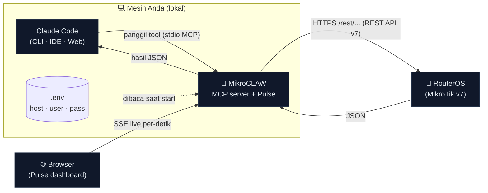
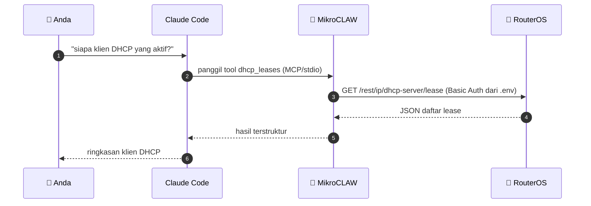
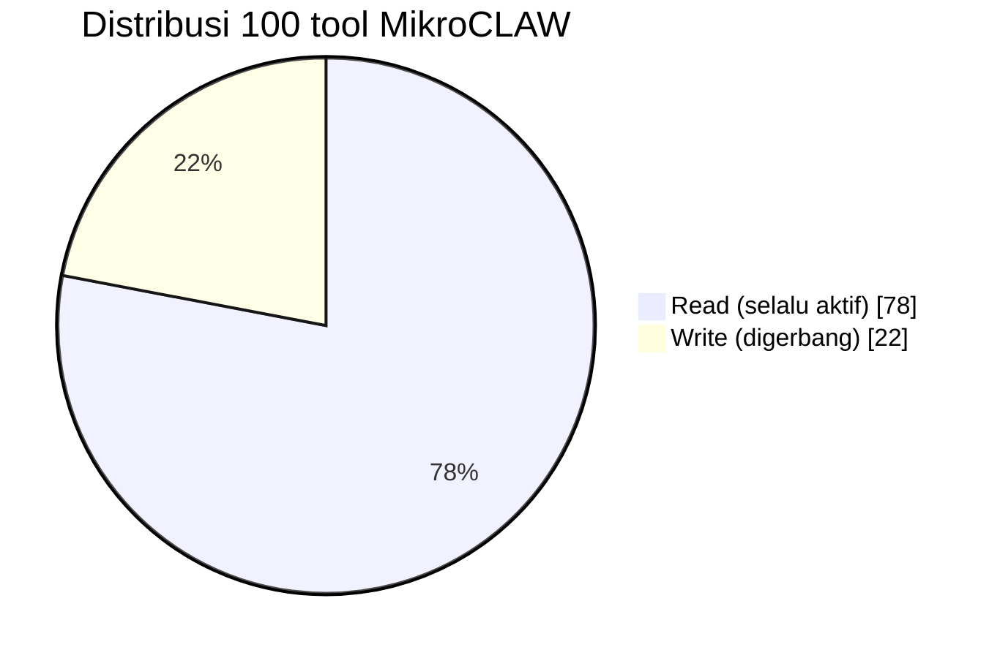
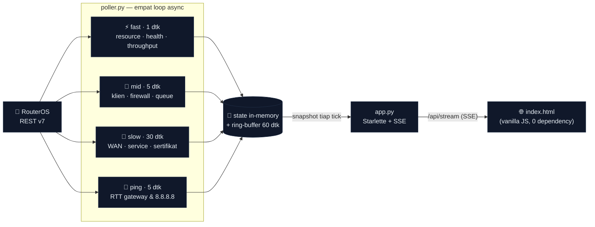

<div align="center">


# 🦅 MikroCLAW

### **Mikro**Tik + **CLAW** (Claude) — kendalikan RouterOS dari percakapan Claude Code

**MCP server yang membuat Claude Code bisa mengakses, memonitor, dan mengelola perangkat MikroTik RouterOS lewat tool ber-skema — plus dashboard monitoring live "Pulse".**

[](#riwayat-versi)
[](LICENSE)
[](#prasyarat)
[](#kompatibilitas-routeros-v6-vs-v7)
[](https://modelcontextprotocol.io)
[-0a7ea4?style=flat-square)](#daftar-tool)
[](#skills-playbook-orkestrasi)
[](#instalasi)
[](#keamanan)
[](#)

</div>

MikroCLAW menjembatani Claude Code dengan RouterOS melalui **REST API RouterOS v7**
(HTTPS). Alih-alih Anda mengetik perintah `curl`/`ssh` manual, Claude memanggil
tool seperti `dhcp_leases` atau `firewall_filter_rules` sebagai pemanggilan ber-skema
— aman, terstruktur, dan kredensial tidak pernah bocor ke jendela chat.

> *"Siapa saja klien DHCP yang aktif?"* · *"Interface mana yang down?"* · *"Blokir IP 10.0.0.5."*
> — cukup ketik dalam bahasa biasa, Claude memanggil tool yang tepat.

### ✨ Kenapa MikroCLAW?

| | |
|---|---|
| 🔒 **Read-only secara default** | Aman untuk eksplorasi & monitoring tanpa risiko mengubah konfigurasi. |
| 🚧 **Operasi write digerbang** | Setiap tool yang mengubah config dikunci flag `MIKROCLAW_ALLOW_WRITE`. |
| 🔑 **Kredensial via `.env`** | Tidak pernah muncul di chat, tidak ikut ter-commit. |
| 🧩 **100 tool ber-skema** | 78 read + 22 write, termasuk lima fitur cerdas (Twin/Sentinel/Chronicle/Replay/Concierge), `detect_roles`, & `rest_get`/`rest_write` generic untuk path apa pun. |
| 🧠 **12 Agent Skills** | Playbook siap pakai: health-check, audit firewall, audit keamanan, overview jaringan, troubleshoot, backup-snapshot, deteksi-peran + 5 fitur cerdas baru. |
| 🤖 **5 fitur cerdas AI** | **Twin** (simulator what-if paket), **Sentinel** (deteksi botnet/IoT terinfeksi tanpa signature), **Chronicle** (mesin waktu konfigurasi + deteksi intrusi), **Replay** (RCA retrospektif "kenapa tadi lemot"), **Concierge** (laporan bisnis RT-RW net). |
| 📟 **MikroCLAW Pulse** | Dashboard web monitoring **live per-detik** (read-only, via Server-Sent Events). |
| ⚙️ **Installer satu-baris** | Windows (PowerShell) & macOS/Linux (bash) — pasang `uv`, dependency, `.env`, daftar MCP. |
| 🌐 **Tanpa lock-in v7** | RouterOS v6 cukup ganti lapis transport ke API biner; daftar tool tetap. |

**Versi terkini: `v1.7.0`** · Python 3.10+ · RouterOS v7.1+ · Lisensi Apache-2.0.

> 📚 **Dokumen lain:** [`docs/FITUR.md`](docs/FITUR.md) (ikhtisar fitur ringkas) ·
> [`MANUAL_BOOK.md`](MANUAL_BOOK.md) (panduan tutorial langkah demi langkah).

---

## Daftar Isi

1. [Bagaimana Claude Code mengakses MikroTik](#bagaimana-claude-code-mengakses-mikrotik)
2. [Prasyarat](#prasyarat)
3. [Persiapan RouterOS](#persiapan-routeros)
4. [Instalasi](#instalasi)
5. [Konfigurasi (.env)](#konfigurasi-env)
6. [Menghubungkan ke Claude Code](#menghubungkan-ke-claude-code)
7. [Daftar tool](#daftar-tool)
8. [Skills (playbook orkestrasi)](#skills-playbook-orkestrasi)
9. [MikroCLAW Pulse — monitoring live](#mikroclaw-pulse--dashboard-monitoring-live)
10. [Contoh penggunaan](#contoh-penggunaan)
11. [Uji manual tanpa Claude](#uji-manual-tanpa-claude)
12. [Keamanan](#keamanan)
13. [Troubleshooting](#troubleshooting)
14. [Kompatibilitas RouterOS v6 vs v7](#kompatibilitas-routeros-v6-vs-v7)
15. [Struktur proyek](#struktur-proyek)
16. [Pengembangan: menambah tool](#pengembangan-menambah-tool)
17. [Riwayat versi](#riwayat-versi)
18. [Lisensi](#lisensi)

---

## Bagaimana Claude Code mengakses MikroTik

Claude Code tidak punya driver MikroTik bawaan. MikroCLAW berperan sebagai
**MCP server** (Model Context Protocol): proses lokal yang mengekspos sekumpulan
*tool*. Claude Code memanggil tool itu; MikroCLAW menerjemahkannya menjadi
panggilan REST API ke RouterOS, lalu mengembalikan JSON hasilnya.



**Alurnya** (mis. *"siapa saja klien DHCP yang aktif?"*):



**Rinciannya:**

1. Anda menulis prompt biasa, mis. *"siapa saja klien DHCP yang aktif?"*.
2. Claude Code memilih tool `dhcp_leases` dan memanggilnya lewat protokol MCP (stdio).
3. MikroCLAW (`client.py`) mengirim `GET https://<router>/rest/ip/dhcp-server/lease`
   dengan Basic Auth dari `.env`.
4. RouterOS membalas JSON; MikroCLAW meneruskannya ke Claude.
5. Claude meringkas/menyajikan hasil untuk Anda.

RouterOS REST memetakan path konsol ke URL secara langsung, contoh:

| Perintah konsol RouterOS | Operasi REST |
|---|---|
| `/interface print` | `GET /rest/interface` |
| `/ip address print` | `GET /rest/ip/address` |
| tambah item | `PUT /rest/<path>` (+ body JSON) |
| ubah item ber-`.id` | `PATCH /rest/<path>/<id>` |
| hapus item ber-`.id` | `DELETE /rest/<path>/<id>` |
| command (ping, dst.) | `POST /rest/<path>` |

---

## Prasyarat

| Komponen | Versi | Catatan |
|---|---|---|
| **RouterOS** | **v7.1+** | REST API hanya ada di v7. Untuk v6 lihat [kompatibilitas](#kompatibilitas-routeros-v6-vs-v7). |
| **Python** | 3.10+ | Diuji pada 3.14. |
| **uv** | terbaru | Pengelola environment/dependency — https://docs.astral.sh/uv/ |
| Akses jaringan | — | Host yang menjalankan MikroCLAW harus bisa menjangkau port 443/80 router. |

---

## Persiapan RouterOS

Lakukan sekali di router. Disarankan **HTTPS** + **user least-privilege**.

```routeros
# 1) (HTTPS) Aktifkan service www-ssl dengan sertifikat yang sudah ada di /certificate.
#    Jika belum punya sertifikat, buat self-signed dulu (lihat di bawah).
/ip/service/set www-ssl certificate=<nama-sertifikat> disabled=no

#    Alternatif cepat (kurang aman): pakai HTTP biasa.
#    /ip/service/set www disabled=no

# 2) Buat user khusus MikroCLAW — JANGAN pakai 'admin' penuh.
/user/add name=mikroclaw password=<password-kuat> group=read     ;# read-only
#    Untuk mengizinkan operasi write, gunakan group=write atau policy kustom.

# 3) Batasi sumber yang boleh mengakses service (mis. hanya subnet LAN/host admin).
/ip/service/set www-ssl address=192.168.88.0/24
```

Membuat sertifikat self-signed (jika belum ada):

```routeros
/certificate/add name=mikroclaw-ca common-name=mikroclaw-ca key-usage=key-cert-sign,crl-sign
/certificate/sign mikroclaw-ca
/certificate/add name=mikroclaw-https common-name=<ip-atau-hostname-router>
/certificate/sign mikroclaw-https ca=mikroclaw-ca
/ip/service/set www-ssl certificate=mikroclaw-https disabled=no
```

> Karena sertifikat self-signed, biarkan `MIKROTIK_VERIFY_TLS=false` di `.env`
> (default). Set `true` hanya jika memakai sertifikat yang tepercaya.

---

## Instalasi

Pilih jalur tercepat sesuai OS Anda — installer mengurus `uv`, dependency, `.env`, dan registrasi MCP sekaligus:

| Jalur | OS | Kapan dipakai | Perintah |
|---|---|---|---|
| 🚀 **Bootstrap 1-baris** | Windows | Belum punya repo, ingin clone + install sekaligus | `irm .../bootstrap.ps1 \| iex` |
| 🚀 **Bootstrap 1-baris** | macOS / Linux | Belum punya repo, ingin clone + install sekaligus | `curl -LsSf .../bootstrap.sh \| bash` |
| 🛠️ **Installer lokal** | Windows | Sudah punya repo | `.\install.ps1` (atau double-click `install.bat`) |
| 🛠️ **Installer lokal** | macOS / Linux | Sudah punya repo | `./install.sh` |
| ✋ **Manual** | semua | Ingin kontrol penuh tiap langkah | `cp .env.example .env` lalu `uv sync` |

Detail tiap jalur di bawah.

### Windows (installer otomatis)

Installer memasang `uv`, dependency (termasuk Python via uv bila perlu),
menulis `.env` secara interaktif, dan mendaftarkan MCP server ke Claude Code.

**Opsi A — satu baris (clone + install)** di PowerShell:

```powershell
irm https://raw.githubusercontent.com/Syamsuddin/MikroCLAW/main/bootstrap.ps1 | iex
```

**Opsi B — sudah punya repo:** masuk folder MikroCLAW lalu **double-click
`install.bat`**, atau di PowerShell:

```powershell
.\install.ps1
```

Argumen berguna: `-MikrotikHost 192.168.88.1 -MikrotikUser mikroclaw`,
`-AllowWrite` (izinkan write), `-NonInteractive`, `-SkipMcpRegister`.
Lepas instalasi: `.\uninstall.ps1` (tambah `-RemoveEnv` / `-RemoveVenv`).

> Jika PowerShell memblokir skrip, jalankan lewat `install.bat` (sudah pakai
> `-ExecutionPolicy Bypass`) atau jalankan PowerShell sebagai:
> `powershell -ExecutionPolicy Bypass -File .\install.ps1`.

### macOS / Linux (installer otomatis)

Installer memasang `uv`, dependency (termasuk Python via uv bila perlu), menulis
`.env` (mode `600`), dan mendaftarkan MCP server ke Claude Code.

**Opsi A — satu baris (clone + install):**

```bash
curl -LsSf https://raw.githubusercontent.com/Syamsuddin/MikroCLAW/main/bootstrap.sh | bash
```

**Opsi B — sudah punya repo:**

```bash
cd /path/ke/MikroCLAW
./install.sh
```

Argumen berguna: `--host 192.168.88.1 --user mikroclaw`, `--allow-write`,
`--http`, `--non-interactive`, `--skip-mcp`.
Lepas instalasi: `./uninstall.sh` (tambah `--remove-env` / `--remove-venv`).

### Manual (Windows / macOS / Linux)

```bash
cd /path/ke/MikroCLAW
cp .env.example .env          # lalu isi host + kredensial router
uv sync                       # pasang dependency (mcp, httpx, python-dotenv)
```

`uv sync` membuat virtualenv `.venv/` dan menginstal proyek beserta dependensinya.

---

## Konfigurasi (.env)

Semua konfigurasi lewat environment / file `.env` (otomatis dibaca saat server start).

| Variabel | Wajib | Default | Keterangan |
|---|---|---|---|
| `MIKROTIK_HOST` | ✅ | — | IP/hostname router, mis. `192.168.88.1`. |
| `MIKROTIK_USER` | — | `admin` | User RouterOS (disarankan user khusus least-privilege). |
| `MIKROTIK_PASSWORD` | — | *(kosong)* | Password user tersebut. |
| `MIKROTIK_USE_TLS` | — | `true` | `true` → HTTPS (www-ssl), `false` → HTTP. |
| `MIKROTIK_PORT` | — | `443`/`80` | Port REST. Default mengikuti `USE_TLS`. |
| `MIKROTIK_VERIFY_TLS` | — | `false` | Verifikasi sertifikat TLS. `false` cocok untuk self-signed. |
| `MIKROTIK_TIMEOUT` | — | `10` | Timeout request (detik). |
| `MIKROCLAW_ALLOW_WRITE` | — | `false` | **Gerbang keamanan.** `true` mengaktifkan tool yang mengubah konfigurasi. |

Contoh `.env` minimal:

```dotenv
MIKROTIK_HOST=192.168.88.1
MIKROTIK_USER=mikroclaw
MIKROTIK_PASSWORD=rahasia-kuat
MIKROTIK_USE_TLS=true
MIKROTIK_VERIFY_TLS=false
MIKROCLAW_ALLOW_WRITE=false
```

---

## Menghubungkan ke Claude Code

File `.mcp.json` sudah disertakan (scope **project**), isinya:

```json
{
  "mcpServers": {
    "mikroclaw": {
      "command": "uv",
      "args": ["run", "--directory", "/Users/syams/PROJECTS/MikroCLAW", "mikroclaw"]
    }
  }
}
```

Server berjalan via **stdio**; kredensial diambil dari `.env` (bukan dari file
ini), jadi `.mcp.json` aman untuk di-commit.

Langkah di Claude Code:

```
/mcp        # cek server "mikroclaw" muncul & status connected
```

Saat pertama kali, Claude Code akan meminta persetujuan untuk menjalankan MCP
server project-scope — setujui untuk mengaktifkannya.

> Ingin dipakai di **semua** proyek, bukan cuma folder ini? Daftarkan sebagai
> user-scope: `claude mcp add mikroclaw -s user -- uv run --directory /Users/syams/PROJECTS/MikroCLAW mikroclaw`

---

## Daftar tool

**100 tool** terbagi dua kelas: **READ** (selalu aktif) dan **WRITE** (digerbang flag).



Cakupan domain READ (ringkas):

| Domain | Contoh tool |
|---|---|
| 🖥️ Sistem & perangkat | `system_resource`, `system_health`, `routerboard_info`, `system_packages`, `system_license` |
| 🔌 Interface & L2 | `list_interfaces`, `ethernet_ports`, `bridge_ports`, `bridge_hosts`, `vlans` |
| 🌐 IP & routing | `list_ip_addresses`, `routing_table`, `arp_table`, `neighbors`, `dhcp_*` |
| 🛡️ Firewall & NAT | `firewall_filter_rules`, `firewall_nat_rules`, `firewall_mangle`, `address_lists`, `firewall_connections` |
| 📶 WiFi & CAPsMAN | `wifi_interfaces`, `wifi_registrations`, `wifi_radios`, `capsman_remote_caps` |
| 🔐 VPN & tunnel | `wireguard_*`, `ppp_active`, `ppp_secrets`, `ipsec_peers`, `ipsec_active_peers` |
| 📈 QoS & bandwidth | `simple_queues`, `queue_tree`, `ppp_profiles`, `ip_pools` |
| 🌍 IPv6 | `ipv6_addresses`, `ipv6_routes`, `ipv6_firewall_filter`, `ipv6_neighbors` |
| 🧭 Routing dinamis | `bgp_sessions`, `ospf_neighbors` |
| 👥 Hotspot & AAA | `hotspot_servers`, `hotspot_active`, `hotspot_users`, `radius_servers` |
| 🔎 Keamanan & audit | `router_users`, `user_groups`, `active_sessions`, `certificates`, `ip_services` |
| 🩺 Diagnostik | `ping`, `traceroute`, `interface_traffic_live`, `recent_logs`, `netwatch`, `check_for_updates` |
| 🧭 Deteksi peran | `detect_roles` (klasifikasikan fungsi router dari bukti konfigurasi) |
| 🤖 Fitur cerdas AI | `simulate_packet`, `simulate_firewall_change` (Twin) · `analyze_client_behavior` (Sentinel) · `config_snapshot`, `config_diff` (Chronicle) · `explain_incident` (Replay) · `business_report` (Concierge) |

### Read — selalu aktif

| Tool | Parameter | Fungsi | REST |
|---|---|---|---|
| `system_resource` | — | Versi RouterOS, CPU, memori, uptime, board, arsitektur. | `GET /system/resource` |
| `system_identity` | — | Nama/identitas perangkat. | `GET /system/identity` |
| `list_interfaces` | — | Semua interface + status running/disabled + statistik. | `GET /interface` |
| `list_ip_addresses` | — | Alamat IP per interface. | `GET /ip/address` |
| `dhcp_leases` | — | Klien DHCP yang mendapat IP dari router. | `GET /ip/dhcp-server/lease` |
| `arp_table` | — | Pemetaan IP ↔ MAC yang terlihat router. | `GET /ip/arp` |
| `firewall_filter_rules` | — | Aturan firewall filter (input/forward/output). | `GET /ip/firewall/filter` |
| `firewall_nat_rules` | — | Aturan NAT (masquerade, port forward). | `GET /ip/firewall/nat` |
| `routing_table` | — | Tabel routing IP (route aktif & statis). | `GET /ip/route` |
| `simple_queues` | — | Simple queue — pembatasan bandwidth per IP/target. | `GET /queue/simple` |
| `address_lists` | — | Isi semua firewall address-list. | `GET /ip/firewall/address-list` |
| `dns_settings` | — | Konfigurasi DNS: server upstream, cache, allow-remote. | `GET /ip/dns` |
| `dhcp_servers` | — | DHCP server + interface & address-pool-nya. | `GET /ip/dhcp-server` |
| `ppp_active` | — | Sesi PPP aktif (PPPoE/L2TP/PPTP/SSTP). | `GET /ppp/active` |
| `bridge_hosts` | — | Tabel host bridge (MAC per port). | `GET /interface/bridge/host` |
| `neighbors` | — | Tetangga terdeteksi (MNDP/CDP/LLDP). | `GET /ip/neighbor` |
| `system_health` | — | Sensor HW: suhu, tegangan, kipas (jika ada). | `GET /system/health` |
| `netwatch` | — | Host yang dipantau Netwatch + status up/down. | `GET /tool/netwatch` |
| `router_users` | — | Daftar user RouterOS + grup/hak aksesnya. | `GET /user` |
| `wifi_interfaces` | — | Interface WiFi (auto wifiwave2/legacy). | `GET /interface/wifi` ↻ `/interface/wireless` |
| `wifi_registrations` | — | Klien WiFi yang terhubung (auto wifiwave2/legacy). | `GET .../registration-table` |
| `wireguard_interfaces` | — | Interface WireGuard (VPN) + public key & port. | `GET /interface/wireguard` |
| `wireguard_peers` | — | Peer WireGuard + allowed-address & handshake. | `GET /interface/wireguard/peers` |
| `ppp_secrets` | — | Akun PPP (PPPoE/VPN) — name/service/profile. | `GET /ppp/secret` |
| `ip_pools` | — | IP pool (rentang IP untuk DHCP/PPP). | `GET /ip/pool` |
| `dns_static` | — | Entri DNS statis (A/CNAME) yang dilayani router. | `GET /ip/dns/static` |
| `ntp_client` | — | Status & konfigurasi NTP client. | `GET /system/ntp/client` |
| `schedulers` | — | Tugas terjadwal RouterOS. | `GET /system/scheduler` |
| `scripts` | — | Script tersimpan di RouterOS. | `GET /system/script` |
| `vlans` | — | Interface VLAN + vlan-id & interface induk. | `GET /interface/vlan` |
| `ip_services` | — | Service IP (api/ssh/www/telnet/winbox) + port. | `GET /ip/service` |
| `dhcp_client` | — | Status DHCP client (mis. IP WAN dari ISP). | `GET /ip/dhcp-client` |
| `ip_cloud` | — | IP publik & DDNS MikroTik (remote access). | `GET /ip/cloud` |
| `system_packages` | — | Paket RouterOS terpasang + status. | `GET /system/package` |
| `routerboard_info` | — | Model, serial, firmware terpasang vs tersedia. | `GET /system/routerboard` |
| `active_sessions` | — | User yang sedang login (audit keamanan). | `GET /user/active` |
| `list_files` | — | File di router (backup/export) + ukuran & waktu. | `GET /file` |
| `firewall_connections` | — | Connection tracking aktif (troubleshooting). | `GET /ip/firewall/connection` |
| `bridge_ports` | — | Pemetaan port ke bridge. | `GET /interface/bridge/port` |
| `certificates` | — | Sertifikat + masa berlaku (audit kedaluwarsa). | `GET /certificate` |
| `dns_cache` | — | Isi cache DNS resolver router. | `GET /ip/dns/cache` |
| `dhcp_networks` | — | Gateway/DNS/netmask yang ditawarkan DHCP. | `GET /ip/dhcp-server/network` |
| `firewall_mangle` | — | Aturan mangle (marking QoS/policy routing). | `GET /ip/firewall/mangle` |
| `queue_tree` | — | Queue tree (bandwidth hierarkis berbasis mark). | `GET /queue/tree` |
| `ppp_profiles` | — | Profil PPP (rate-limit, pool, DNS). | `GET /ppp/profile` |
| `user_groups` | — | Grup hak akses + policy (audit keamanan). | `GET /user/group` |
| `ethernet_ports` | — | Detail port ethernet (link speed, auto-neg). | `GET /interface/ethernet` |
| `ipsec_peers` | — | Konfigurasi peer IPsec. | `GET /ip/ipsec/peer` |
| `ipsec_active_peers` | — | Tunnel IPsec yang sedang aktif. | `GET /ip/ipsec/active-peers` |
| `ipv6_addresses` | — | Alamat IPv6 per interface. | `GET /ipv6/address` |
| `ipv6_routes` | — | Tabel routing IPv6. | `GET /ipv6/route` |
| `ipv6_firewall_filter` | — | Aturan firewall filter IPv6. | `GET /ipv6/firewall/filter` |
| `ipv6_neighbors` | — | Tabel neighbor IPv6 (NDP). | `GET /ipv6/neighbor` |
| `hotspot_servers` | — | Server hotspot + interface & profil. | `GET /ip/hotspot` |
| `hotspot_active` | — | User hotspot yang sedang login. | `GET /ip/hotspot/active` |
| `hotspot_users` | — | Akun user hotspot. | `GET /ip/hotspot/user` |
| `capsman_remote_caps` | — | CAP/AP yang dikelola CAPsMAN (auto legacy/wifiwave2). | `GET /caps-man/remote-cap` ↻ wifiwave2 |
| `capsman_registrations` | — | Klien via CAPsMAN (auto legacy/wifiwave2). | `GET .../registration-table` |
| `wifi_radios` | — | Radio WiFi fisik (wifiwave2). | `GET /interface/wifi/radio` |
| `bgp_sessions` | — | Sesi BGP (v7). | `GET /routing/bgp/session` |
| `ospf_neighbors` | — | Neighbor OSPF + state adjacency (v7). | `GET /routing/ospf/neighbor` |
| `radius_servers` | — | Server RADIUS (AAA). | `GET /radius` |
| `system_history` | — | Riwayat perubahan config (undo). | `GET /system/history` |
| `system_license` | — | Info lisensi (level/CHR). | `GET /system/license` |
| `recent_logs` | `limit` (default 50) | Log terbaru RouterOS. | `GET /log` |
| `ping` | `address`, `count` (default 3) | Ping dari router ke sebuah alamat (diagnostik). | `POST /ping` |
| `traceroute` | `address`, `count` (default 3) | Traceroute (jejak hop) dari router. | `POST /tool/traceroute` |
| `interface_traffic_live` | `interface` | Satu sampel throughput real-time (rx/tx bps). | `POST /interface/monitor-traffic` |
| `check_for_updates` | — | Cek update RouterOS (tidak mengubah config). | `POST /system/package/update/check-for-updates` |
| `detect_roles` | — | **Deteksi peran perangkat** (gateway NAT, firewall, BGP/OSPF, switch/AP, BRAS, VPN, DHCP/DNS, QoS, dll) + bukti & keyakinan. | multi `GET` (introspeksi) |
| `simulate_packet` | `src`, `dst`, `protocol`, `dst_port`, … | **Twin** — telusuri paket hipotetis menembus mangle→dst-nat→routing→filter→src-nat di atas ruleset live; lapor verdict + jejak. | multi `GET` (model murni) |
| `simulate_firewall_change` | `src`, `dst`, `new_rule`, … | **Twin** — uji dampak satu aturan firewall baru SEBELUM diterapkan (diff verdict). | multi `GET` (model murni) |
| `analyze_client_behavior` | `ip` (opsional) | **Sentinel** — sidik-jari perilaku per-perangkat dari conntrack; deteksi botnet IoT/miner/scan tanpa signature, berkonteks kelas perangkat. | `GET /ip/firewall/connection` + lease/arp |
| `config_snapshot` | `label` | **Chronicle** — simpan snapshot konfigurasi relevan-keamanan (ber-hash) ke disk lokal. | multi `GET` → file lokal |
| `config_diff` | `simpan` | **Chronicle** — diff konfigurasi live vs snapshot terakhir + penilaian risiko (user baru, port mgmt dibuka, persistensi, dll). | multi `GET` → diff |
| `explain_incident` | `mulai_menit_lalu`, `selesai_menit_lalu` | **Replay** — rekonstruksi telemetri jendela waktu lampau (riwayat Pulse) + anomali untuk RCA "kenapa tadi lemot". | file riwayat lokal |
| `business_report` | `plan_down_mbps`, `wan_interface`, … | **Concierge** — terjemahkan telemetri jadi sinyal bisnis RT-RW net (pelanggan, akun nganggur, pencuri bandwidth, utilisasi WAN). | multi `GET` (ppp/hotspot/queue) |
| `rest_get` | `path` | **GET generic** ke path REST apa pun (read-only). | `GET /<path>` |

Contoh `rest_get` untuk hal yang belum punya tool khusus:
`ip/dns`, `ppp/active`, `interface/wireless`, `system/clock`, `queue/simple`.

### Write — perlu `MIKROCLAW_ALLOW_WRITE=true`

Jika flag bernilai `false` (default), tool ini mengembalikan error dan **tidak**
menyentuh router.

| Tool | Parameter | Fungsi | REST |
|---|---|---|---|
| `set_interface_enabled` | `interface_id`, `enabled` | Aktif/nonaktifkan interface (by `.id` atau nama). | `PATCH /interface/<id>` |
| `add_firewall_drop` | `src_address`, `chain` (default `forward`), `comment` | Tambah aturan DROP untuk sumber tertentu. | `PUT /ip/firewall/filter` |
| `add_address_list_entry` | `address`, `address_list`, `comment`, `timeout` | Tambah IP/subnet ke firewall address-list. | `PUT /ip/firewall/address-list` |
| `delete_firewall_rule` | `rule_id` | Hapus satu aturan firewall filter by `.id`. | `DELETE /ip/firewall/filter/<id>` |
| `set_firewall_rule_enabled` | `rule_id`, `enabled` | Aktif/nonaktifkan satu aturan firewall by `.id`. | `PATCH /ip/firewall/filter/<id>` |
| `add_simple_queue` | `name`, `target`, `max_limit` | Tambah simple queue (batas bandwidth target). | `PUT /queue/simple` |
| `create_backup` | `name` (default `mikroclaw`) | Buat file backup konfigurasi (.backup) di router. | `POST /system/backup/save` |
| `reboot_router` | — | Reboot router sekarang (mengganggu koneksi). | `POST /system/reboot` |
| `add_dns_static` | `name`, `address`, `ttl` | Tambah entri DNS statis (A record). | `PUT /ip/dns/static` |
| `add_ppp_secret` | `name`, `password`, `service`, `profile` | Tambah akun PPP (PPPoE/VPN). | `PUT /ppp/secret` |
| `add_wireguard_peer` | `interface`, `public_key`, `allowed_address`, `endpoint_address`, `endpoint_port` | Tambah peer WireGuard. | `PUT /interface/wireguard/peers` |
| `set_ip_service_enabled` | `service_id`, `enabled` | Aktif/nonaktifkan IP service (mis. matikan telnet). | `PATCH /ip/service/<id>` |
| `add_nat_rule` | `chain`, `action`, +opsional (`protocol`, `dst_port`, `to_addresses`, `to_ports`, dll) | Tambah NAT: port-forward (dstnat) / masquerade (srcnat). | `PUT /ip/firewall/nat` |
| `add_static_route` | `dst_address`, `gateway`, `distance`, `comment` | Tambah route statis (termasuk default route). | `PUT /ip/route` |
| `add_static_dhcp_lease` | `address`, `mac_address`, `server`, `comment` | Pin IP statis ke MAC (static lease). | `PUT /ip/dhcp-server/lease` |
| `assign_ip_address` | `address`, `interface`, `comment` | Pasang IP (CIDR) ke interface. | `PUT /ip/address` |
| `set_identity` | `name` | Ganti nama/identitas router. | `POST /system/identity/set` |
| `set_dns_servers` | `servers`, `allow_remote_requests` | Set DNS upstream router. | `POST /ip/dns/set` |
| `remove_address_list_entry` | `entry_id` | Hapus entri address-list by `.id`. | `DELETE /ip/firewall/address-list/<id>` |
| `add_hotspot_user` | `name`, `password`, `profile`, `comment` | Tambah akun user hotspot. | `PUT /ip/hotspot/user` |
| `add_ipv6_address` | `address`, `interface`, `comment` | Pasang alamat IPv6 ke interface. | `PUT /ipv6/address` |
| `rest_write` | `method` (PUT/PATCH/DELETE/POST), `path`, `body` | **Write generic** untuk operasi lanjutan. Gunakan hati-hati. | sesuai `method` |

---

## Skills (playbook orkestrasi)

Selain 100 tool atomik, MikroCLAW menyertakan **Agent Skills** di
[`.claude/skills/`](.claude/skills/) — playbook yang mengoordinasikan banyak tool
menjadi alur kerja siap pakai. Claude Code memuatnya otomatis saat frasa pemicunya
muncul; bisa juga dipanggil eksplisit dengan `/<nama-skill>`.

| Skill | Fungsi | Pemicu contoh |
|---|---|---|
| `mikrotik-health-check` | Laporan kesehatan & maintenance (resource, suhu, firmware, update, WAN, NTP). | "cek kesehatan router", "ada update routeros?" |
| `mikrotik-firewall-audit` | Tinjau filter/NAT/mangle, address-list, koneksi; temuan + rekomendasi. | "audit firewall", "firewall monitoring" |
| `mikrotik-security-audit` | Hardening: service terbuka, user/grup, sesi, sertifikat, DNS, proteksi input. | "audit keamanan", "apakah router aman" |
| `mikrotik-network-overview` | Snapshot inventaris: WAN, subnet, interface/VLAN, routing, klien, tetangga. | "overview jaringan", "dokumentasi config" |
| `mikrotik-troubleshoot` | Diagnosa konektivitas berlapis (L1→IP→DNS→firewall). | "internet mati", "tidak bisa browsing" |
| `mikrotik-backup-snapshot` | Backup biner + snapshot JSON konfigurasi kunci untuk diff/dokumentasi. | "backup mikrotik", "snapshot sebelum perubahan" |
| `mikrotik-role-detect` | Deteksi & jelaskan peran perangkat (gateway/firewall/BGP/AP/BRAS/VPN/…) beserta bukti & keyakinan. | "deteksi peran mikrotik", "router ini berfungsi sebagai apa" |
| `mikrotik-twin` 🆕 | **Simulator what-if** — telusuri nasib paket & uji aturan firewall baru sebelum diterapkan. | "kalau klien X akses Y lolos?", "simulasikan rule ini", "uji firewall sebelum pasang" |
| `mikrotik-sentinel` 🆕 | **Deteksi perangkat terinfeksi** — botnet IoT/miner/scan dari perilaku koneksi, tanpa signature. | "ada perangkat terinfeksi?", "cek botnet", "kenapa CCTV ini aneh" |
| `mikrotik-chronicle` 🆕 | **Mesin waktu konfigurasi** — snapshot + diff berisiko untuk deteksi perubahan/intrusi. | "apa yang berubah di config?", "deteksi perubahan tak terjadwal", "ada backdoor?" |
| `mikrotik-replay` 🆕 | **RCA retrospektif** — jelaskan insiden masa lampau dari riwayat telemetri. | "kenapa tadi sore lemot?", "internet sempat putus jam berapa" |
| `mikrotik-concierge` 🆕 | **Laporan bisnis** — pelanggan, akun nganggur, pencuri bandwidth, utilisasi WAN, kapan upgrade. | "laporan bisnis RT-RW net", "ada yang nyolong bandwidth?", "perlu upgrade paket?" |

Semua skill **read-only secara default**; remediasi yang mengubah konfigurasi selalu
meminta konfirmasi dan tetap butuh `MIKROCLAW_ALLOW_WRITE=true`.

## MikroCLAW Pulse — dashboard monitoring live

Selain MCP server, MikroCLAW menyertakan **Pulse**: laman web monitoring yang
memperbarui indikator **per detik** lewat Server-Sent Events.

- **Fase 1 — data plane:** **read-only**, tanpa dependency baru (memakai Starlette +
  uvicorn yang sudah ikut `mcp`). Memantau RouterOS bertingkat & menyusun state live.
- **Fase 2 — lapis AI (opsional):** kartu **🧠 AI Analyst** menarasikan kondisi
  jaringan, mendeteksi anomali tanpa ambang tetap, mengkorelasikan akar masalah, dan
  menyarankan remediasi — memanggil **Anthropic Messages API** langsung via `httpx`
  (tanpa SDK), output terstruktur lewat tool-use. **Tetap read-only** (hanya membaca
  snapshot). Aktif bila `ANTHROPIC_API_KEY` di-set; tanpa itu Pulse tetap jalan dan
  kartu AI menampilkan status "nonaktif".
- **Fase 3 — AI proaktif:** **🔮 Prediksi tren deterministik** (regresi linear dari
  riwayat → tren %/jam + ETA mencapai ambang untuk CPU/memori/disk — jalan **tanpa**
  API key), plus **⚡ Remediasi 1-klik** yang diusulkan AI dan dieksekusi dari
  dashboard. Remediasi **di-gate ganda**: butuh `MIKROCLAW_ALLOW_WRITE=true` **dan**
  hanya aksi dari allowlist sempit (`blokir_ip`, `tambah_address_list`,
  `nonaktifkan_service`) yang persis diusulkan AI — tiap aksi diberi komentar audit
  `added-by-pulse-ai`.

```bash
# memakai kredensial yang sama dari .env
uv run mikroclaw-web                 # atau:  python -m mikroclaw.web
# buka http://127.0.0.1:8800
```

**Arsitektur Pulse — empat loop polling bertingkat → state in-memory → SSE → browser:**



> 💡 **Throughput** diturunkan dari **delta counter rx/tx `/interface`** (satu request untuk semua interface), bukan `monitor-traffic` per-interface — jauh lebih ringan untuk router.

| ENV | Default | Keterangan |
|---|---|---|
| `MIKROCLAW_WEB_HOST` | `127.0.0.1` | Alamat bind. Set `0.0.0.0` untuk diakses dari LAN. |
| `MIKROCLAW_WEB_PORT` | `8800` | Port HTTP laman. |
| `ANTHROPIC_API_KEY` | *(kosong)* | **Mengaktifkan lapis AI (Fase 2).** Tanpa ini, kartu AI tampil "nonaktif". |
| `MIKROCLAW_AI_MODEL` | `claude-sonnet-4-6` | Model Claude untuk analisis. |
| `MIKROCLAW_AI_INTERVAL` | `60` | Detik antar-analisis otomatis. |
| `MIKROCLAW_AI_MAX_TOKENS` | `2048` | Batas token output analisis. |

**Yang ditampilkan (semua dari tool read yang ada):**

- **Vitals (1 dtk):** CPU, memori, disk, suhu/tegangan, jumlah klien, firewall
  drops/dtk, conntrack, sesi login, sertifikat terdekat kedaluwarsa.
- **WAN:** IP WAN/publik, DDNS, gateway, RTT ping gateway & `8.8.8.8`, sparkline
  download/upload 60 detik.
- **Interface matrix (1 dtk):** throughput rx/tx live (delta counter), status
  link, link-speed, error/drop.
- **Klien:** gabungan DHCP + PPPoE + hotspot + WiFi (sinyal), tebakan vendor dari
  OUI MAC, dan bandwidth per-klien bila ada simple queue yang cocok.
- **Service terbuka:** ditandai merah bila berisiko (telnet/ftp/www/api) tanpa
  batasan `address`.
- **Log Stream:** tail `/log` terbaru dengan pewarnaan severity (error/warning).
- **🧠 AI Analyst (Fase 2):** status sehat/perhatian/kritis, ringkasan naratif,
  daftar anomali ber-severity, dan rekomendasi — plus tombol **"Analisa sekarang"**.
- **🔮 Prediksi Tren (Fase 3):** tren & ETA CPU/memori/disk (deterministik,
  tanpa API key).
- **⚡ Remediasi 1-klik (Fase 3):** tombol eksekusi aksi yang diusulkan AI
  (muncul ter-kunci bila write-gate mati).

Cadence bertingkat (1 dtk vitals/interface · 5 dtk klien & ping · 30 dtk WAN/
service/sertifikat & sampel prediksi · analisis AI default 60 dtk) agar tidak
membebani router. Endpoint: `/` (laman), `/api/stream` (SSE), `/api/snapshot`
(JSON sekali ambil), `/api/analyze` (POST — picu analisis AI), `/api/remediate`
(POST — eksekusi 1 aksi remediasi; butuh `ALLOW_WRITE`).

## Contoh penggunaan

Cukup minta dalam bahasa biasa di Claude Code:

- *"Tampilkan versi RouterOS dan pemakaian CPU/memori."* → `system_resource`
- *"Siapa saja klien DHCP yang aktif sekarang?"* → `dhcp_leases`
- *"Interface mana yang sedang down?"* → `list_interfaces`
- *"Tunjukkan 100 baris log terakhir yang mengandung error."* → `recent_logs` + filter
- *"Ping 8.8.8.8 dari router."* → `ping`
- *"Apa konfigurasi DNS router?"* → `rest_get path=ip/dns`
- *"Blokir IP 10.0.0.5 di firewall."* → `add_firewall_drop` *(butuh `ALLOW_WRITE=true`)*
- *"Nonaktifkan interface ether5."* → `set_interface_enabled` *(butuh `ALLOW_WRITE=true`)*

---

## Uji manual tanpa Claude

Memastikan REST hidup & kredensial benar sebelum menyalakan dari Claude:

```bash
source .env
curl -sk -u "$MIKROTIK_USER:$MIKROTIK_PASSWORD" \
  "https://$MIKROTIK_HOST/rest/system/resource" | jq .
```

Uji server MCP-nya sendiri (memuat & mendaftarkan tool, tanpa konek router):

```bash
uv run python -c "
import asyncio
from mikroclaw.server import mcp
tools = asyncio.run(mcp.list_tools())
print(f'{len(tools)} tools:', ', '.join(t.name for t in tools))
"
```

### Test suite (pytest)

Tersedia unit test untuk client REST, helper poller, prediksi/throughput,
remediasi, lapis AI, dan endpoint Pulse — semuanya **offline** (httpx di-mock,
tanpa router/jaringan/biaya API):

```bash
uv run --extra test pytest    # memasang & menjalankan pytest (extra 'test')
```

```
83 passed in 0.45s
```

---

## Keamanan

- **User least-privilege** — buat user khusus (mis. grup `read`); jangan pakai `admin` penuh.
- **Pisahkan kredensial** — hanya di `.env`, yang sudah masuk `.gitignore`. Jangan tempel password di chat atau di `.mcp.json`.
- **Gunakan TLS** — `MIKROTIK_USE_TLS=true`. Set `MIKROTIK_VERIFY_TLS=true` setelah memasang sertifikat tepercaya.
- **Batasi sumber akses** di router: `/ip/service/set www-ssl address=<subnet-tepercaya>`.
- **Write off by default** — biarkan `MIKROCLAW_ALLOW_WRITE=false` kecuali memang sedang melakukan perubahan; matikan lagi sesudahnya.
- **Audit** — operasi `add_firewall_drop` menyertakan komentar `added-by-mikroclaw` agar mudah ditelusuri/dihapus.

---

## Troubleshooting

| Gejala | Kemungkinan sebab | Solusi |
|---|---|---|
| `MIKROTIK_HOST belum di-set` | `.env` belum dibuat/diisi | `cp .env.example .env`, isi `MIKROTIK_HOST`. |
| `Gagal menghubungi RouterOS ...` (timeout) | Port REST tertutup / host salah / firewall | Cek `/ip/service`, ketersambungan jaringan, dan `MIKROTIK_PORT`. |
| `RouterOS membalas 401` | User/password salah | Periksa `MIKROTIK_USER`/`MIKROTIK_PASSWORD`. |
| `RouterOS membalas 404` | Path tidak ada di versi RouterOS ini | Cek nama path; sebagian fitur beda antar versi. |
| Error sertifikat / SSL | Self-signed + verify aktif | Set `MIKROTIK_VERIFY_TLS=false`. |
| `Operasi write dinonaktifkan` | Mencoba tool write saat gate off | Set `MIKROCLAW_ALLOW_WRITE=true` di `.env`, restart server. |
| Server tak muncul di `/mcp` | `.mcp.json` belum disetujui | Jalankan `/mcp`, setujui server project-scope; pastikan `uv` ada di PATH. |
| Perubahan `.env` tak terbaca | Server masih pakai proses lama | Restart koneksi MCP (toggle via `/mcp`) agar `.env` dibaca ulang. |

---

## Kompatibilitas RouterOS v6 vs v7

REST API **hanya ada di RouterOS v7**. Jika router Anda v6:

- Antarmuka tool di `server.py` **tidak perlu berubah**.
- Ganti lapisan transport di `client.py` ke **API biner** (port `8728`/`8729` TLS)
  memakai library seperti [`librouteros`](https://github.com/luqasz/librouteros).
- `RouterOSClient.get/put/patch/delete` cukup dipetakan ke perintah API biner;
  sisanya (config, server, daftar tool) tetap sama.

API biner juga bekerja di v7, sehingga bisa dipakai sebagai transport tunggal
lintas versi bila diinginkan.

---

## Struktur proyek

```
MikroCLAW/
├── .mcp.json              # registrasi server untuk Claude Code (project-scope)
├── .env.example           # template variabel environment
├── .env                   # kredensial nyata (di-gitignore, buat sendiri)
├── .gitignore
├── pyproject.toml         # metadata + dependency + entry point `mikroclaw`
├── README.md
├── CLAUDE.md              # panduan repo untuk Claude Code (arsitektur & konvensi)
├── LICENSE                # Apache License 2.0
├── install.ps1 / install.sh    # installer (Windows / macOS+Linux)
├── install.bat                 # launcher double-click untuk install.ps1
├── uninstall.ps1 / uninstall.sh# lepas registrasi MCP (opsi hapus .env/.venv)
├── bootstrap.ps1 / bootstrap.sh# clone + install satu baris
├── tests/                 # unit test pytest (offline, httpx di-mock)
├── .claude/skills/        # Agent Skills (playbook orkestrasi tool)
│   ├── mikrotik-health-check/SKILL.md
│   ├── mikrotik-firewall-audit/SKILL.md
│   ├── mikrotik-security-audit/SKILL.md
│   ├── mikrotik-network-overview/SKILL.md
│   ├── mikrotik-troubleshoot/SKILL.md
│   ├── mikrotik-backup-snapshot/SKILL.md
│   ├── mikrotik-role-detect/SKILL.md
│   ├── mikrotik-twin/SKILL.md          # 🆕 simulator what-if
│   ├── mikrotik-sentinel/SKILL.md      # 🆕 deteksi perangkat terinfeksi
│   ├── mikrotik-chronicle/SKILL.md     # 🆕 mesin waktu konfigurasi
│   ├── mikrotik-replay/SKILL.md        # 🆕 RCA retrospektif
│   └── mikrotik-concierge/SKILL.md     # 🆕 laporan bisnis
└── src/mikroclaw/
    ├── __init__.py        # versi paket
    ├── config.py          # baca .env/env → objek Config + validasi
    ├── client.py          # client REST RouterOS v7 (async httpx)
    ├── roles.py           # classify_roles: deteksi peran dari bukti (murni)
    ├── storage.py         # 🆕 helper state dir lokal (Chronicle & Replay)
    ├── twin.py            # 🆕 Twin: engine simulator paket (murni)
    ├── sentinel.py        # 🆕 Sentinel: sidik-jari perilaku perangkat (murni)
    ├── chronicle.py       # 🆕 Chronicle: snapshot/diff/risiko konfigurasi (murni)
    ├── concierge.py       # 🆕 Concierge: telemetri → sinyal bisnis (murni)
    ├── server.py          # FastMCP + definisi 100 tool + write-gate
    └── web/               # MikroCLAW Pulse — dashboard monitoring live
        ├── poller.py      # data plane: poll bertingkat + ring-buffer + throughput + prediksi
        ├── history.py     # 🆕 Replay: persistensi riwayat telemetri + ringkasan jendela
        ├── analyst.py     # lapis AI (Fase 2): Anthropic Messages API via httpx
        ├── actions.py     # remediasi 1-klik (Fase 3): allowlist aksi write yang aman
        ├── app.py         # Starlette + SSE + endpoint analyze/remediate + entry `mikroclaw-web`
        └── static/
            └── index.html # dashboard vanilla JS (tanpa dependency eksternal)
```

---

## Pengembangan: menambah tool

Tambahkan fungsi async di `src/mikroclaw/server.py` dengan dekorator `@mcp.tool()`.
Docstring menjadi deskripsi tool yang dilihat Claude — tulis sejelas mungkin.

Contoh menambah daftar simple queue (read):

```python
@mcp.tool()
async def simple_queues() -> Any:
    """Daftar simple queue (pembatasan bandwidth per target)."""
    return await _ros().get("/queue/simple")
```

Contoh tool write (selalu panggil `_require_write()` di awal):

```python
@mcp.tool()
async def reboot_router() -> Any:
    """Reboot router. BUTUH MIKROCLAW_ALLOW_WRITE=true."""
    _require_write()
    return await _ros().post("/system/reboot")
```

Setelah mengubah kode, restart koneksi MCP di Claude Code (`/mcp`) agar tool baru
terdeteksi. Verifikasi cepat:

```bash
uv run python -c "import asyncio; from mikroclaw.server import mcp; print(len(asyncio.run(mcp.list_tools())), 'tools')"
```

---

## Riwayat versi

| Versi | Sorotan |
|---|---|
| **v1.7.0** | **5 fitur cerdas AI** — **Twin** (simulator what-if paket: `simulate_packet`/`simulate_firewall_change`), **Sentinel** (deteksi botnet IoT/miner/scan tanpa signature: `analyze_client_behavior`), **Chronicle** (mesin waktu konfigurasi + deteksi intrusi: `config_snapshot`/`config_diff`), **Replay** (RCA retrospektif: `explain_incident`), **Concierge** (laporan bisnis RT-RW net: `business_report`) + 5 skill baru. **100 tool · 12 skill · 151 test.** |
| **v1.6.0** | **Deteksi peran** — tool `detect_roles` (introspeksi → klasifikasi gateway/firewall/BGP/OSPF/switch/AP/BRAS/VPN/QoS/… + bukti & keyakinan) & skill `mikrotik-role-detect`. **93 tool · 7 skill.** |
| **v1.5.0** | **Pulse Fase 3 — AI proaktif:** prediksi tren deterministik (CPU/mem/disk + ETA) & **remediasi 1-klik** ter-gate ganda (write-flag + allowlist + cocok usulan AI) lewat `POST /api/remediate`. |
| **v1.4.0** | **Pulse Fase 2 — lapis AI Analyst** (Anthropic Messages API via httpx, read-only, output terstruktur lewat tool-use) + **Log Stream** dengan pewarnaan severity + endpoint `POST /api/analyze`. |
| **v1.3.0** | **MikroCLAW Pulse** — laman web monitoring live per-detik (Starlette + SSE, read-only; tanpa dependency baru). |
| v1.2.0 | Installer **macOS / Linux** (bash) + bootstrap satu-baris. |
| v1.1.0 | Installer **Windows** (PowerShell) + bootstrap satu-baris. |
| v1.0.0 | Rilis awal — MCP server (**92 tool**: 70 read + 22 write) + **6 Agent Skills**. |

> Penomoran mengikuti urutan milestone fitur pada histori git; rincian tiap perubahan ada di `git log`.

---

## Lisensi

Dirilis di bawah **Apache License 2.0** — lihat [`LICENSE`](LICENSE).

---

*MikroCLAW dibuat untuk administrasi MikroTik yang sah pada perangkat milik/dikuasakan
kepada Anda. Gunakan secara bertanggung jawab.*
