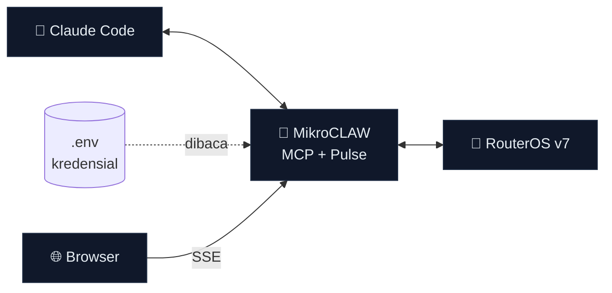
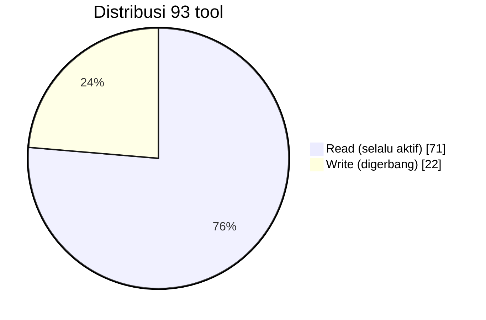
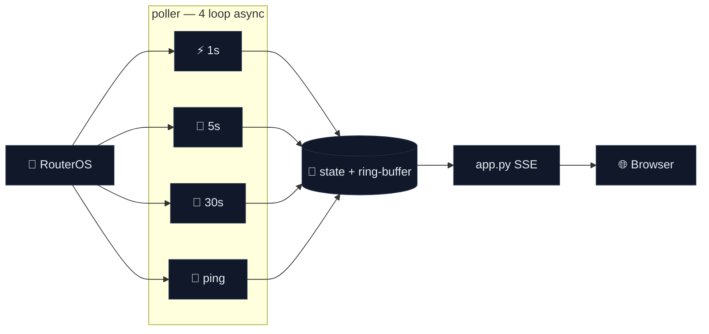

<div align="center">


# 📋 Ikhtisar Fitur — MikroCLAW

**Rangkuman lengkap seluruh fitur sampai versi terkini.**

`v1.6.0` · 93 tool (71 read + 22 write) · 7 Agent Skills · RouterOS v7.1+ · Apache-2.0

</div>

> Dokumen ini adalah ringkasan. Untuk detail teknis lihat [`../README.md`](../README.md);
> untuk panduan langkah demi langkah lihat [`../MANUAL_BOOK.md`](../MANUAL_BOOK.md).

---

## 🦅 Inti

MCP server yang menghubungkan **Claude Code** ↔ **MikroTik RouterOS v7** (REST API),
plus dashboard monitoring **Pulse**. Read-only secara default, ditulis dalam Bahasa
Indonesia, lisensi Apache-2.0.



---

## 🧩 1. MCP Server — 93 tool ber-skema (71 read + 22 write)



### READ (71) — selalu aktif

| Domain | Contoh tool |
|---|---|
| Sistem & perangkat | `system_resource`, `system_health`, `routerboard_info`, `system_packages`, `system_license` |
| Interface & L2 | `list_interfaces`, `ethernet_ports`, `bridge_ports`, `bridge_hosts`, `vlans` |
| IP & routing | `list_ip_addresses`, `routing_table`, `arp_table`, `neighbors`, `dhcp_leases` |
| Firewall / NAT | `firewall_filter_rules`, `firewall_nat_rules`, `firewall_mangle`, `address_lists`, `firewall_connections` |
| WiFi / CAPsMAN | `wifi_interfaces`, `wifi_registrations`, `wifi_radios`, `capsman_remote_caps` |
| VPN & tunnel | `wireguard_interfaces`, `wireguard_peers`, `ipsec_peers`, `ipsec_active_peers`, `ppp_active` |
| QoS & bandwidth | `simple_queues`, `queue_tree`, `ppp_profiles`, `ip_pools` |
| Routing dinamis | `bgp_sessions`, `ospf_neighbors` |
| IPv6 | `ipv6_addresses`, `ipv6_routes`, `ipv6_firewall_filter`, `ipv6_neighbors` |
| Hotspot / AAA | `hotspot_servers`, `hotspot_active`, `hotspot_users`, `radius_servers`, `user_groups` |
| Keamanan & audit | `router_users`, `active_sessions`, `certificates`, `ip_services` |
| Diagnostik | `ping`, `traceroute`, `interface_traffic_live`, `recent_logs`, `netwatch`, `check_for_updates` |
| **🧭 Deteksi peran** | **`detect_roles`** (lihat §4) |
| Generic | `rest_get` (GET ke path REST apa pun) |

### WRITE (22) — perlu `MIKROCLAW_ALLOW_WRITE=true`

| Kategori | Tool |
|---|---|
| Firewall | `add_firewall_drop`, `delete_firewall_rule`, `set_firewall_rule_enabled`, `add_nat_rule` |
| Address-list | `add_address_list_entry`, `remove_address_list_entry` |
| Interface / IP | `set_interface_enabled`, `assign_ip_address`, `add_ipv6_address` |
| QoS | `add_simple_queue` |
| DNS / PPP / VPN | `add_dns_static`, `set_dns_servers`, `add_ppp_secret`, `add_wireguard_peer` |
| Routing / DHCP | `add_static_route`, `add_static_dhcp_lease` |
| Hotspot | `add_hotspot_user` |
| Sistem | `set_identity`, `set_ip_service_enabled`, `create_backup`, `reboot_router` |
| Generic | `rest_write` |

---

## 🧠 2. Agent Skills (7 playbook read-only)

| Skill | Fungsi |
|---|---|
| `mikrotik-health-check` | Laporan kesehatan & maintenance (resource, suhu, firmware, update, WAN, NTP) |
| `mikrotik-firewall-audit` | Tinjau filter/NAT/mangle, address-list, koneksi + rekomendasi |
| `mikrotik-security-audit` | Hardening: service, user/grup, sesi, sertifikat, DNS, proteksi input |
| `mikrotik-network-overview` | Snapshot inventaris: WAN, subnet, interface/VLAN, routing, klien, tetangga |
| `mikrotik-troubleshoot` | Diagnosa konektivitas berlapis (L1→IP→DNS→firewall) |
| `mikrotik-backup-snapshot` | Backup biner + snapshot JSON konfigurasi kunci |
| `mikrotik-role-detect` | Deteksi & jelaskan peran perangkat + bukti & keyakinan |

Terpicu otomatis oleh frasa Bahasa Indonesia, atau dipanggil eksplisit `/<nama-skill>`.

---

## 📟 3. MikroCLAW Pulse — dashboard live (3 fase)

Laman web read-only, update **per detik** via Server-Sent Events
(`uv run mikroclaw-web` → http://127.0.0.1:8800).



### Fase 1 — data plane (read-only)
Vitals (CPU/RAM/disk/suhu/tegangan), WAN + RTT gateway & internet, **interface matrix**
(throughput dari delta counter rx/tx), klien gabungan (DHCP/PPPoE/hotspot/WiFi + tebakan
vendor OUI), service terbuka (merah bila berisiko), **log stream** berwarna severity.

### Fase 2 — 🧠 AI Analyst *(opsional, butuh `ANTHROPIC_API_KEY`)*
Narasi kondisi jaringan, deteksi anomali **tanpa ambang tetap**, korelasi akar masalah
lintas-subsistem, rekomendasi — via Anthropic Messages API (httpx, output terstruktur
tool-use). Tombol **"Analisa sekarang"** (`POST /api/analyze`). Tanpa key, Pulse tetap
jalan & kartu AI menampilkan "nonaktif".

### Fase 3 — AI proaktif
- 🔮 **Prediksi tren** deterministik: regresi linear riwayat → tren %/jam + **ETA**
  mencapai ambang untuk CPU/memori/disk. **Jalan tanpa API key.**
- ⚡ **Remediasi 1-klik**: aksi usulan AI dieksekusi dari dashboard, **di-gate tiga lapis** —
  (1) `MIKROCLAW_ALLOW_WRITE=true`, (2) allowlist sempit (`blokir_ip`, `tambah_address_list`,
  `nonaktifkan_service`), (3) harus persis aksi yang diusulkan AI (`POST /api/remediate`).

| ENV Pulse | Default | Keterangan |
|---|---|---|
| `MIKROCLAW_WEB_HOST` / `PORT` | `127.0.0.1` / `8800` | Bind & port |
| `ANTHROPIC_API_KEY` | — | Mengaktifkan lapis AI |
| `MIKROCLAW_AI_MODEL` | `claude-sonnet-4-6` | Model analisis |
| `MIKROCLAW_AI_INTERVAL` / `MAX_TOKENS` | `60` / `2048` | Cadence & batas token |

---

## 🧭 4. Deteksi peran perangkat

`detect_roles` mengintrospeksi ~30 menu RouterOS lalu **mengklasifikasikan peran**
beserta **bukti** & **tingkat keyakinan** (logika murni di `roles.py`, teruji penuh).

Peran yang dikenali: **gateway NAT**, port-forward (DSTNAT), **firewall** stateful,
**BGP/OSPF router**, router statis, **switch/bridge L2**, VLAN trunk, **Access Point**,
WiFi station, **CAPsMAN** controller, **hotspot** gateway, **PPPoE server (BRAS)**,
PPPoE/DHCP client (WAN), **DHCP server**, **DNS resolver**, web proxy, container host,
**VPN** (WireGuard/IPsec/L2TP/SSTP/OpenVPN), tunnel GRE/EoIP/IPIP, **QoS** shaper,
**VRRP** (HA).

---

## 🔒 5. Keamanan

- **Read-only secara default** — write digerbang `MIKROCLAW_ALLOW_WRITE`.
- **Kredensial hanya di `.env`** (gitignored, tak pernah di chat / `.mcp.json`).
- **HTTPS** + verifikasi TLS opsional; saran **user least-privilege** di router.
- **Remediasi Pulse di-gate ganda** + komentar audit `added-by-pulse-ai`.

---

## ⚙️ 6. Instalasi & distribusi

- Installer otomatis **Windows** (PowerShell / `install.bat`) & **macOS/Linux** (bash).
- **Bootstrap 1-baris** (clone + pasang `uv`, dependency, tulis `.env`, daftarkan MCP).
- Uninstaller; mode **manual** `uv sync`.

---

## ✅ 7. Kualitas — test suite

**96 unit test pytest, offline** (httpx di-mock, tanpa router/jaringan/biaya API):
client REST, helper poller, prediksi & throughput, remediasi, lapis AI, endpoint Pulse,
klasifikasi peran.

```bash
uv run --extra test pytest    # → 96 passed
```

---

## 📚 8. Dokumentasi

| Berkas | Isi |
|---|---|
| [`README.md`](../README.md) | Ikhtisar, badge, diagram, daftar 93 tool, instalasi, riwayat versi |
| [`MANUAL_BOOK.md`](../MANUAL_BOOK.md) | Panduan tutorial lengkap (instalasi → kesimpulan) |
| `docs/FITUR.md` | Dokumen ini — ringkasan fitur |
| `.claude/skills/` | Sumber 7 Agent Skills |
| `tests/` | Suite pytest offline |

---

## 🗓️ Riwayat versi

| Versi | Sorotan |
|---|---|
| **v1.6.0** | **Deteksi peran** — tool `detect_roles` + skill `mikrotik-role-detect` |
| v1.5.0 | Pulse **Fase 3** — prediksi tren + remediasi 1-klik |
| v1.4.0 | Pulse **Fase 2** — AI Analyst + log stream |
| v1.3.0 | Pulse **Fase 1** — dashboard monitoring live |
| v1.2.0 | Installer macOS / Linux + bootstrap |
| v1.1.0 | Installer Windows + bootstrap |
| v1.0.0 | Rilis awal — MCP server + 6 Agent Skills |

*Tambahan tak-berversi: test suite pytest offline.*

---

<div align="center">

**🦅 MikroCLAW** — administrasi MikroTik yang sah, aman, dan menyenangkan.

Dirilis di bawah **Apache License 2.0**

</div>
